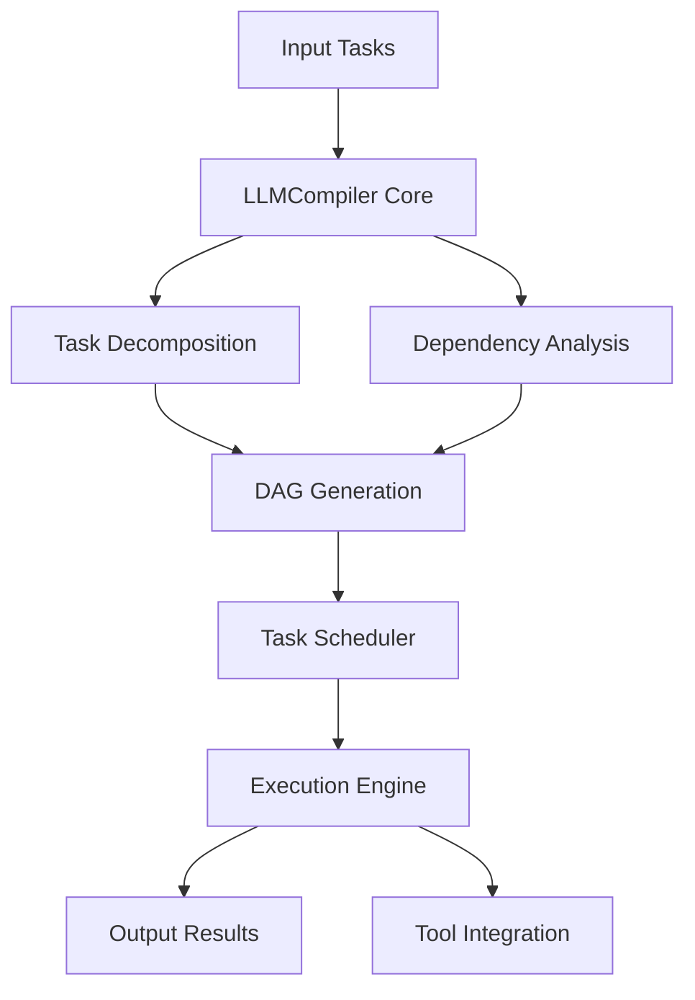
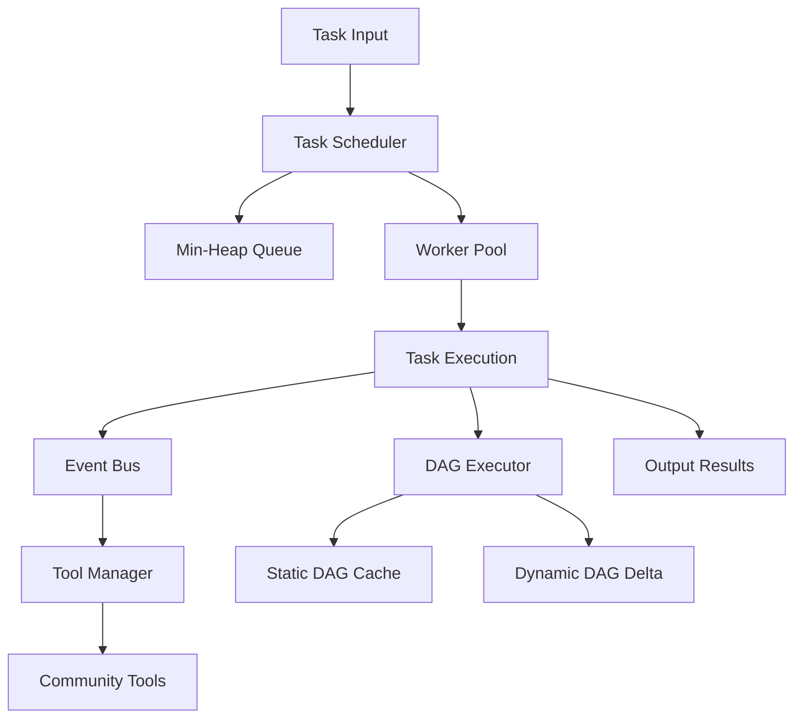

# Dragonscale Engineering Design Document

## 1. Introduction

### 1.1 Purpose

Dragonscale is a Golang library designed to provide an efficient execution runtime for LLM adapters. Inspired by LLMCompiler, it optimizes task execution through concurrency, hexagonal architecture, and advanced task scheduling, targeting applications requiring high performance and extensibility.

### 1.2 Scope

This document outlines the design and implementation of Dragonscale, detailing its architecture, components, and strategies for task management, concurrency, and tool integration, enhanced with Mermaid diagrams and solutions to future improvements.

### 1.3 References

- [GitHub Repository: golang-low-level-design/task-scheduler](https://github.com/the-arcade-01/golang-low-level-design/tree/main/task-scheduler)
- [LLMCompiler ICML 2024 Paper](https://arxiv.org/abs/2312.04511)

## 2. System Overview

### 2.1 Goals

- Provide a robust runtime for LLM adapters with efficient task scheduling.
- Support concurrent task execution with optimized resource management.
- Enable extensibility through community-defined tools using Model Context Protocol or WASM.
- Ensure modularity and adaptability via hexagonal architecture and strategy pattern.

### 2.2 Key Features

- **Task Scheduler**: Priority-based scheduling for one-time, fixed-rate, and fixed-delay tasks.
- **Concurrency**: Worker pool with automated sizing for parallel execution.
- **DAG Integration**: Dynamic and static Directed Acyclic Graphs (DAGs) with caching, pre-emption, and advanced optimization.
- **Extensibility**: Plug-in tools via configuration files or WASM modules with sandboxing.
- **Event Bus**: Loose coupling between components for scalability and flexibility.

### 2.3 LLMCompiler Diagram

Below is a Mermaid diagram illustrating the high-level architecture of LLMCompiler, which inspires Dragonscale:



### 2.4 Dragonscale Diagram

Below is a Mermaid diagram representing Dragonscale’s architecture:



## 3. Requirements

### 3.1 Functional Requirements

- **Task Management**: Create, schedule, and stop tasks dynamically with attributes like priority and execution type.
- **Task Execution**: Execute tasks based on priority and scheduled time, supporting multiple execution types.
- **Concurrency**: Manage multiple tasks concurrently with an adaptive worker pool.
- **Tool Integration**: Integrate community-defined tools securely.

### 3.2 Non-Functional Requirements

- **Scalability**: Handle large task volumes efficiently.
- **Performance**: Optimize resource usage with advanced algorithms.
- **Thread Safety**: Ensure safe concurrent operations.
- **Extensibility**: Support future enhancements seamlessly.

## 4. Architecture

### 4.1 Hexagonal Architecture

Dragonscale uses a hexagonal architecture:

- **Core Domain**: Task scheduling and execution logic.
- **Ports**: Interfaces for task management and tool integration.
- **Adapters**: Worker pools, event bus, and tool implementations.

### 4.2 Components

- **Task Scheduler**: Priority-based task management.
- **Worker Pool**: Concurrent execution with automated sizing.
- **Event Bus**: Decoupled component communication.
- **Strategy Pattern**: Flexible execution strategies.
- **Tool Manager**: Sandboxed tool integration.
- **DAG Executor**: Advanced DAG handling.

### 4.3 Code Structure

```
github.com/ZanzyTHEbar/dragonscale/
├── cmd/
│   └── main.go
├── internal/
│   ├── config/
│   │   └── pool.go
│   ├── domain/
│   │   ├── task.go
│   │   └── scheduler.go
│   ├── ports/
│   │   └── executor.go
│   ├── adapters/
│   │   ├── workerpool/
│   │   ├── eventbus/
│   │   └── tools/
│   └── utils/
└── go.mod
```

## 5. Design Details

### 5.1 Task Scheduler

Uses a min-heap for O(log n) scheduling:

```go
type TaskScheduler struct {
    mutex     *sync.Mutex
    cond      *sync.Cond
    pool      *WorkerPool
    taskQueue *TaskHeap
}

func (ts *TaskScheduler) Schedule(task *Task) {
    ts.mutex.Lock()
    defer ts.mutex.Unlock()
    heap.Push(ts.taskQueue, task)
    ts.cond.Signal()
}
```

### 5.2 Worker Pool with Automated Sizing

Automatically adjusts worker count based on system load:

```go
type WorkerPool struct {
    workers     int
    workerQueue chan Runnable
    wg          sync.WaitGroup
    monitor     *LoadMonitor
}

type LoadMonitor struct {
    cpuThreshold float64
    memThreshold float64
}

func NewWorkerPool() *WorkerPool {
    lm := &LoadMonitor{cpuThreshold: 0.8, memThreshold: 0.9}
    workers := runtime.NumCPU() // Initial size
    pool := &WorkerPool{
        workers:     workers,
        workerQueue: make(chan Runnable, 100),
        monitor:     lm,
    }
    go pool.adjustSize()
    pool.startWorkers()
    return pool
}

func (wp *WorkerPool) adjustSize() {
    for {
        time.Sleep(10 * time.Second)
        cpuUsage := wp.monitor.GetCPUUsage()
        memUsage := wp.monitor.GetMemUsage()
        if cpuUsage > wp.monitor.cpuThreshold || memUsage > wp.monitor.memThreshold {
            wp.workers++
            wp.wg.Add(1)
            go wp.worker()
        } else if wp.workers > runtime.NumCPU() && cpuUsage < 0.5 {
            wp.workers--
        }
    }
}

func (wp *WorkerPool) worker() {
    defer wp.wg.Done()
    for task := range wp.workerQueue {
        task.Run()
    }
}
```

### 5.3 DAG Integration with Advanced Optimization

Supports advanced DAG optimization algorithms:

- **Critical Path Method (CPM)**: Identifies the longest path to prioritize tasks.
- **List Scheduling with Priority**: Assigns tasks to workers based on priority and dependencies.

```go
type DAGExecutor struct {
    cache map[string]*DAG
}

func (de *DAGExecutor) OptimizeAndExecute(dag *DAG) {
    if dag.Cacheable {
        de.cache[dag.ID] = dag
    }
    criticalPath := de.computeCriticalPath(dag)
    sortedTasks := de.listSchedule(dag, criticalPath)
    for _, task := range sortedTasks {
        taskScheduler.pool.Add(task)
    }
}

func (de *DAGExecutor) computeCriticalPath(dag *DAG) []int {
    // Simplified CPM: Calculate longest path through DAG
    durations := make(map[int]int)
    for i, task := range dag.Nodes {
        durations[i] = task.EstimatedDuration
        // Update with dependencies
    }
    return de.findLongestPath(durations, dag.Edges)
}

func (de *DAGExecutor) listSchedule(dag *DAG, criticalPath []int) []*Task {
    // Priority-based scheduling respecting dependencies
    return dag.Nodes // Placeholder for sorted list
}
```

## 6. Performance Optimization

- **Heap**: O(log n) task scheduling.
- **Signal-Based Scheduling**: Reduces CPU usage.
- **DAG Caching**: Minimizes recomputation.
- **Automated Worker Sizing**: Balances load dynamically.

## 7. Limitations and Solutions

### 7.1 Known Limitations

- **Dynamic DAG Complexity**: High overhead for frequent updates.
- **Concurrency Overhead**: Excessive goroutines may degrade performance.

### 7.2 Solutions

- **Dynamic DAG**: Use delta storage with periodic compaction to reduce complexity.
  ```go
  func (de *DAGExecutor) UpdateDynamicDAG(dag *DAG, delta *Delta) {
      dag.ApplyDelta(delta)
      if time.Since(dag.LastCompaction) > 1*time.Hour {
          dag.Compact()
      }
  }
  ```
- **Concurrency**: Cap worker pool size with automated scaling limits.
  ```go
  func (wp *WorkerPool) adjustSize() {
      if wp.workers > runtime.NumCPU()*2 {
          wp.workers = runtime.NumCPU() * 2 // Cap at 2x CPU cores
      }
  }
  ```

### 7.3 Future Work

- **Advanced DAG Algorithms**: Integrate machine learning for predictive scheduling.
- **Tool Ecosystem**: Expand WASM support with a plugin marketplace.

## 8. Conclusion

Dragonscale leverages Golang’s concurrency and LLMCompiler’s optimizations, enhanced with advanced DAG algorithms, automated worker sizing, and solutions to limitations, making it a robust and future-ready runtime for LLM adapters.
