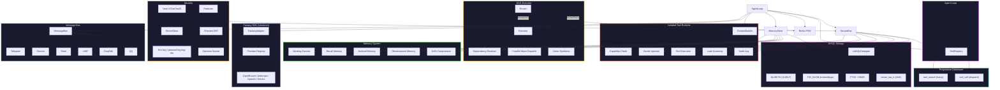

# DragonScale

DragonScale is a compact AI agent runtime for Linux and embedded environments, focused on
memory-aware context management, secure tool execution, and practical local-first deployment.

DragonScale diverges from upstream with its own architectural decisions:
 
- vendored LLM SDK
- MemGPT-style tiered memory
- Isolated Tool Runtime: 
  - capability-based security
  - DAG-based parallel tool execution
  - libSQL-native storage with vector search

> [!NOTE] 
> Where it makes sense, upstream changes are merged back. This is not a strict rule, but a guideline.

---

## Why DragonScale Exists

The original project is a solid foundation — a single-binary AI agent designed for constrained devices. But it has architectural gaps that limit extensibility:

- **No privilege boundary** between the LLM and tool execution — a compromised tool has full process access
- **No structured memory** beyond flat markdown files
- **All tools loaded into context** every request (token waste at scale)
- **Sequential tool calling only** — each tool call requires a full inference pass
- **Hand-rolled LLM provider implementations** with no streaming, retry, or multi-provider support

This project addresses those gaps while preserving strengths: a small binary, low memory footprint, and single-process deployment.

## Architecture


```mermaid
flowchart TB
    subgraph AgentLoop["Agent Loop"]
        AL[AgentLoop] --> CB[ContextBuilder]
        AL --> TR[ToolRegistry]
        AL --> MS[MemoryStore]
        AL --> FSM[ReAct FSM]
    end

    subgraph ITR["Isolated Tool Runtime"]
        SB[SecureBus] --> CAP[Capability Check]
        SB --> SI[Secret Injection]
        SB --> EX[Tool Execution]
        SB --> LS[Leak Scanning]
        SB --> AU[Audit Log]
    end

    subgraph DAG["DAG Executor"]
        DE[Executor] --> RES[Dependency Resolver]
        DE --> WAVE[Parallel Wave Dispatch]
        DE --> JOIN[Joiner Synthesis]
        RT[Router] -->|ModeReAct| FSM
        RT -->|ModeDAG| DE
    end

    subgraph Fantasy["Fantasy SDK (vendored)"]
        FA[FantasyAdapter] --> FP[Provider Registry]
        FP --> OR[OpenRouter / Anthropic / OpenAI / Gemini]
    end

    subgraph Progressive["Progressive Disclosure"]
        TR --> TS["tool_search (fuzzy)"]
        TR --> TC["tool_call (dispatch)"]
    end

    subgraph Memory["Memory System"]
        MS --> WC[Working Context]
        MS --> RC[Recall Memory]
        MS --> AR[Archival Memory]
        MS --> OBS[Observational Memory]
        MS --> DAGC[DAG Compression]
    end

    subgraph Storage["libSQL Storage"]
        DEL[LibSQLDelegate] --> BLOB["BLOB PK (UUIDv7)"]
        DEL --> F32["F32_BLOB (embeddings)"]
        DEL --> FTS["FTS5 + BM25"]
        DEL --> VEC["vector_top_k (ANN)"]
    end

    subgraph Security["Security"]
        VLT[Vault XChaCha20] --> SS[SecretStore]
        SS --> KR[Env key / planned keyring-file]
        RED[Redactor] --> SB
        ZKP[Planned ZKP] -.-> SOCK[Daemon Socket]
    end

    subgraph Bus["Message Bus"]
        BUS[MessageBus] --> TG[Telegram]
        BUS --> DC[Discord]
        BUS --> SL[Slack]
        BUS --> LN[LINE]
        BUS --> DT[DingTalk]
        BUS --> QQ[QQ]
    end

    AL --> SB
    AL --> FA
    MS --> DEL
    AL --> BUS
    SB --> TR

    style AgentLoop fill:#1a1a2e,stroke:#e066ff,stroke-width:2px,color:#fff
    style ITR fill:#1a1a2e,stroke:#ff6b6b,stroke-width:2px,color:#fff
    style DAG fill:#1a1a2e,stroke:#ffab00,stroke-width:2px,color:#fff
    style Fantasy fill:#1a1a2e,stroke:#4d94ff,stroke-width:2px,color:#fff
    style Progressive fill:#1a1a2e,stroke:#00bfa5,stroke-width:2px,color:#fff
    style Memory fill:#1a1a2e,stroke:#2eb82e,stroke-width:2px,color:#fff
    style Storage fill:#1a1a2e,stroke:#9c27b0,stroke-width:2px,color:#fff
    style Security fill:#1a1a2e,stroke:#ff9800,stroke-width:2px,color:#fff
    style Bus fill:#1a1a2e,stroke:#607d8b,stroke-width:2px,color:#fff
```

### Key Design Decisions

| Decision | Rationale |
|----------|-----------|
| **Isolated Tool Runtime** | All tool calls route through a `SecureBus` that mediates execution, applies recursion-depth policy, performs `arg:` secret injection, scans LLM-facing output for leaks, and writes audit logs. Broader network/filesystem capability enforcement plus daemon/WASM isolation remain follow-on work. See [ADR-001](docs/adr/001-isolated-tool-runtime.md). |
| **DAG executor** | LLMCompiler-style parallel tool dispatch. The planner builds a dependency DAG in a single inference pass; the executor dispatches independent nodes concurrently. Joiner synthesizes results. Replanning on failure. Falls back to ReAct for simple single-tool cases. |
| **Vendored Fantasy SDK** | `charm.land/fantasy` vendored into `internal/fantasy/` via `go.mod` replace directive. Enables direct modification for streaming hooks, tool call repair, and progressive disclosure. |
| **MemGPT + Projection Kernel** | Working context (hot), recall items (warm), archival chunks (cold, embedded + indexed), observational memory, immutable messages, DAG snapshots, runtime checkpoints, and an active-context projection builder that assembles the live turn context. Semantic ContextTree scoring and RLM reduction now participate in the hot path. |
| **Progressive tool disclosure** | Gateway tools stay visible, and the agent gets a small query-aware direct toolset for the current request. Wider discovery still flows through `tool_search` / `tool_call` and dynamic promotion, which keeps prompt size down without hiding obvious direct actions. |
| **libSQL over modernc/sqlite** | Native F32_BLOB for vector storage, `libsql_vector_idx` for ANN search, FTS5 for full-text. Single database, no external vector DB dependency. |
| **BLOB primary keys** | 16-byte UUIDv7 stored as BLOB. Compact, byte-comparable, monotonically sortable by creation time. |
| **XChaCha20-Poly1305 vault** | Secrets are encrypted at rest with XChaCha20-Poly1305. The current user-facing master-key flow is env-backed via `DRAGONSCALE_MASTER_KEY`; richer keyring/file-backed flows remain roadmap work. |
| **Goose migrations** | Schema managed by `pressly/goose/v3`. 17 versioned migrations currently cover core schema, FTS5, vector indexes, KV store, documents, audit log outcomes, conversations, runtime state, DAG/checkpoint data, map operators, memory edges, soft delete, immutable messages, and RL/task-completion tables. |
| **FlatBuffers command protocol** | Zero-copy serialized `ToolRequest`/`ToolResponse` for the ITR command vocabulary. The binary format is live on the in-process command path today and is designed to extend to socket/WASM transports as those optional surfaces mature. |

## Project Layout

```
cmd/dragonscale/              # CLI entrypoint
internal/fantasy/          # Vendored charm.land/fantasy SDK
docs/adr/                  # Architecture Decision Records
eval/                      # Promptfoo-based evaluation harness
pkg/
├── agent/                 # Agent loop, ReAct FSM, context builder
│   ├── conversations/     # Conversation store (multi-turn tracking)
│   ├── mentions/          # Mention tracking
│   └── threads/           # Thread store
├── auth/                  # OAuth2 + PKCE for provider auth
├── bus/                   # Hub-and-spoke message bus
├── cache/                 # Generic LRU+TTL cache (SWR, tag invalidation)
├── channels/              # Telegram, Discord, Slack, LINE, DingTalk, QQ, MaixCAM
├── config/                # JSON config with env var overrides, XDG paths
├── cron/                  # Cron scheduler (gronx-based)
├── devices/               # Hardware device hotplug (USB on Linux)
├── fantasy/               # Fantasy SDK adapter (provider factory, type conversion)
├── health/                # HTTP health/readiness endpoints
├── heartbeat/             # Periodic task execution
├── ids/                   # UUIDv7 generation + BLOB codec
├── itr/                   # Isolated Tool Runtime
│   ├── dag/               # DAG executor, planner, resolver, router, replanner
│   ├── itrfb/             # FlatBuffers generated code (command protocol)
│   └── wasm/              # wazero WASM isolate runtime + transport
├── logger/                # Structured logger
├── memory/                # Memory system
│   ├── dag/               # DAG-based context budget compression
│   ├── delegate/          # libSQL storage backend (FTS5, vector, capabilities)
│   ├── migrations/        # Goose versioned schema migrations (001–017)
│   ├── observation/       # Observational memory (observer, reflector, store)
│   ├── sqlc/              # sqlc config + generated code
│   └── store/             # MemoryStore, retrieval, chunking, scoring, queuing
├── messages/              # Canonical message/tool-call types
├── dserrors/               # Structured error types
├── rlm/                   # Recursive Language Model engine (rope, fanout, strategy)
├── security/              # Vault, SecretStore, Redactor, URL guard, Schnorr ZKP
│   └── securebus/         # SecureBus (policy, audit, transport, socket transport)
├── session/               # Session manager with LRU disk-backed cache
├── skills/                # Skill loader, installer, dependency graph, templates
├── tools/                 # Tool registry, meta-tools, built-in tools, CapableTool
├── voice/                 # Groq Whisper voice transcription
└── worker/                # Background job worker
cmd/dragonscale/workspace/skills/ # Embedded builtin skills packaged with the CLI
config/                    # Example configuration files
```

## Quick Start

### Build from source

> [!IMPORTANT]
> Requires `CGO_ENABLED=1` — the go-libsql driver links against glibc.
> Build/runtime target is Linux only (no macOS, no Windows, no musl).

```bash
git clone https://github.com/ZanzyTHEbar/dragonscale.git
cd dragonscale
make build
```


### Configure

```bash
./bin/dragonscale onboard
```

The onboard wizard initializes config, identity files, builtin skills, and the sandbox.

Edit `~/.config/dragonscale/config.json` (or `$XDG_CONFIG_HOME/dragonscale/config.json`):

```json
{
  "agents": {
    "defaults": {
      "model": "anthropic/claude-sonnet-4-20250514",
      "max_tokens": 8192,
      "temperature": 0.7,
      "max_tool_iterations": 20
    }
  },
  "providers": {
    "openrouter": {
      "api_key": "sk-or-v1-xxx",
      "api_base": "https://openrouter.ai/api/v1"
    }
  },
  "tools": {
    "web": {
      "duckduckgo": { "enabled": true, "max_results": 5 }
    }
  }
}
```

### Run

```bash
# One-shot
dragonscale agent -m "What is 2+2?"

# Interactive REPL
dragonscale agent

# Gateway (Telegram, Discord, etc.)
dragonscale gateway
```

### Docker

```bash
cp config/config.example.json config/config.json
# Edit config/config.json, or copy .env.example to .env and fill DRAGONSCALE_* variables.
docker compose --profile gateway up -d
docker compose logs -f dragonscale-gateway
```

The Compose profile mounts config at `/home/dragonscale/.config/dragonscale/config.json`, passes documented `DRAGONSCALE_*` variables through to the container, and persists runtime data under `/home/dragonscale/.local/share/dragonscale`.
The default example routes `anthropic/claude-sonnet-4-20250514` through OpenRouter, so set `DRAGONSCALE_PROVIDERS_OPENROUTER_API_KEY`; for direct Anthropic, set provider `anthropic` and model `claude-sonnet-4-20250514` instead. Optional `.env` loading requires a modern Docker Compose v2 release that supports `env_file.required`.

## Secret Management

DragonScale encrypts secrets at rest with XChaCha20-Poly1305 and stores them in `~/.config/dragonscale/secrets.json` by default.
Today the supported operator flow is env-backed: `dragonscale secret init` prints a hex key, and secret operations expect `DRAGONSCALE_MASTER_KEY` to be set.

```bash
dragonscale secret init           # Generate a master key
dragonscale secret add <name>     # Store a secret (interactive prompt)
dragonscale secret list            # List secret names
dragonscale secret delete <name>  # Remove a secret
```

> [!WARNING]
> This is a security-sensitive operation. The master key is used to encrypt and decrypt secrets. If you lose it, you will not be able to decrypt existing secrets.
> Treat the printed key like a root credential: do not commit it, paste it into logs, or leave it in shell history.


Set the master key: `export DRAGONSCALE_MASTER_KEY=<hex>`

Tools declare which secrets they need via `CapableTool.Capabilities()`. The SecureBus centrally supports `arg:` secret injection today, and it scans LLM-facing tool output for leaked patterns before results reach the agent loop. `env:` / `header:` injection modes remain tool-specific follow-up work.

## Daemon Mode

DragonScale can start a standalone SecureBus daemon over a Unix domain socket for operator workflows, but the main `agent` / `gateway` runtime still uses in-process SecureBus today. Treat daemon mode as an optional deployment surface; socket-client integration and ZKP auth remain follow-on work.

```bash
dragonscale daemon start          # Start daemon (foreground, Ctrl+C to stop)
dragonscale daemon status         # Check if running
dragonscale daemon stop           # Stop a running daemon
```

## LLM Providers

The Fantasy SDK handles provider routing. Configure any supported provider:

| Provider | Config Key | Notes |
|----------|-----------|-------|
| OpenCode Go | `opencode-go` | Low-cost subscription ($10/mo) for open coding models |
| OpenCode Zen | `opencode-zen` | Pay-as-you-go AI gateway with curated models |
| ChatGPT (OAuth) | `chatgpt` | ChatGPT Plus/Pro subscription via OAuth token |
| OpenRouter | `openrouter` | Access to all models via single API key |
| Anthropic | `anthropic` | Claude direct |
| OpenAI | `openai` | GPT direct |
| Google Gemini | `gemini` | Gemini direct |
| Groq | `groq` | Fast inference + Whisper voice transcription |

**OpenCode Go / Zen** share a single credentials block in `config.json`:

```json
"providers": {
  "opencode": { "api_key": "oc-...", "api_base": "" }
}
```

Set `agents.defaults.provider` to `opencode-go` or `opencode-zen` to select the subscription tier.
You can also route by model prefix, for example `opencode-go/kimi-k2.6` or `opencode-zen/gpt-5.5`; DragonScale strips the provider prefix before sending the model ID upstream.
API keys and billing: [OpenCode Auth](https://opencode.ai/auth).

**ChatGPT Plus/Pro subscriptions** are supported via the OAuth-only `chatgpt` provider. Authenticate with `dragonscale auth login --provider openai`, then set `agents.defaults.provider` to `chatgpt` and use a supported Codex model such as `gpt-5.5`. Eval auto-detects stored ChatGPT OAuth only when no explicit provider and no configured API-key provider are available. For standard OpenAI Platform API keys, use the `openai` provider instead.

**OpenAI Responses WebSocket streaming** is opt-in for OpenAI Platform API keys. Set `providers.openai.responses_websocket=true` (or `DRAGONSCALE_PROVIDERS_OPENAI_RESPONSES_WEBSOCKET=true`) with a Responses-capable model such as `gpt-5.5` to stream via `wss://api.openai.com/v1/responses` instead of HTTP SSE.

Provider model lists can be refreshed on demand with `dragonscale models refresh --provider opencode-go --force` or `dragonscale models refresh --force` for all configured OpenAI-compatible providers plus public OpenCode catalogs. The cache is stored under DragonScale's user cache directory and is used only as a disk-backed fallback after static provider routing, so normal agent startup never performs model-list network calls. Use `dragonscale models list` to inspect cached models and freshness status.

Live provider integration tests are skipped by default. To validate all live provider paths, run with `DRAGONSCALE_RUN_LIVE_PROVIDER_TESTS=true`. For partial runs, use `DRAGONSCALE_RUN_LIVE_CHATGPT_TESTS=true go test ./pkg/fantasy -run TestLiveChatGPTCodexOAuthResponses -v` or `cd internal/fantasy && DRAGONSCALE_RUN_LIVE_OPENAI_RESPONSES_WS_TESTS=true go test ./providers/openai -run TestLiveOpenAIResponsesWebSocketStream -v`. ChatGPT requires `DRAGONSCALE_LIVE_CHATGPT_REFRESH_TOKEN` and optionally `DRAGONSCALE_LIVE_CHATGPT_ACCESS_TOKEN`, `DRAGONSCALE_LIVE_CHATGPT_ACCOUNT_ID`, and `DRAGONSCALE_LIVE_CHATGPT_MODEL`. OpenAI Responses WebSocket requires `FANTASY_OPENAI_API_KEY` or `OPENAI_API_KEY`, and optionally `DRAGONSCALE_LIVE_OPENAI_RESPONSES_WS_MODEL`.

API key links: [OpenRouter](https://openrouter.ai/keys) · [Anthropic](https://console.anthropic.com) · [OpenAI](https://platform.openai.com) · [Gemini](https://aistudio.google.com/api-keys) · [Groq](https://console.groq.com)

## Chat Channels

| Channel | Setup Complexity |
|---------|-----------------|
| Telegram | Easy — single bot token |
| Discord | Easy — bot token + message content intent |
| QQ | Easy — AppID + AppSecret |
| DingTalk | Medium — app credentials |
| LINE | Medium — credentials + webhook URL |
| Slack | Medium — app credentials + event subscriptions |

<details>
<summary><b>Telegram</b></summary>

1. Create bot via `@BotFather` on Telegram, copy token
2. Get your user ID from `@userinfobot`
3. Configure:

```json
{
  "channels": {
    "telegram": {
      "enabled": true,
      "token": "YOUR_BOT_TOKEN",
      "allow_from": ["YOUR_USER_ID"]
    }
  }
}
```

4. Run `dragonscale gateway`
</details>

<details>
<summary><b>Discord</b></summary>

1. Create application at https://discord.com/developers/applications
2. Create bot, copy token, enable MESSAGE CONTENT INTENT
3. Get your User ID (Developer Mode → right-click avatar → Copy User ID)
4. Configure:

```json
{
  "channels": {
    "discord": {
      "enabled": true,
      "token": "YOUR_BOT_TOKEN",
      "allow_from": ["YOUR_USER_ID"]
    }
  }
}
```

5. Invite bot: OAuth2 → URL Generator → Scopes: `bot` → Permissions: `Send Messages`, `Read Message History`
6. Run `dragonscale gateway`
</details>

<details>
<summary><b>QQ</b></summary>

1. Create application at [QQ Open Platform](https://q.qq.com/#)
2. Configure:

```json
{
  "channels": {
    "qq": {
      "enabled": true,
      "app_id": "YOUR_APP_ID",
      "app_secret": "YOUR_APP_SECRET",
      "allow_from": []
    }
  }
}
```

3. Run `dragonscale gateway`
</details>

<details>
<summary><b>DingTalk</b></summary>

1. Create internal app at [DingTalk Open Platform](https://open.dingtalk.com/)
2. Configure:

```json
{
  "channels": {
    "dingtalk": {
      "enabled": true,
      "client_id": "YOUR_CLIENT_ID",
      "client_secret": "YOUR_CLIENT_SECRET",
      "allow_from": []
    }
  }
}
```

3. Run `dragonscale gateway`
</details>

<details>
<summary><b>LINE</b></summary>

1. Create Messaging API channel at [LINE Developers Console](https://developers.line.biz/)
2. Configure:

```json
{
  "channels": {
    "line": {
      "enabled": true,
      "channel_secret": "YOUR_CHANNEL_SECRET",
      "channel_access_token": "YOUR_CHANNEL_ACCESS_TOKEN",
      "webhook_host": "0.0.0.0",
      "webhook_port": 18791,
      "webhook_path": "/webhook/line",
      "allow_from": []
    }
  }
}
```

3. Set up HTTPS webhook (e.g., `ngrok http 18791`) and configure the URL in LINE console
4. Run `dragonscale gateway`
</details>

## Memory System

DragonScale implements a multi-tier memory system combining MemGPT-style storage with immutable history, DAG snapshots, semantic context selection, and active-context projection:

| Tier | Purpose | Storage | Search |
|------|---------|---------|--------|
| **Working Context** | Current focus, active goals | Single JSON document per agent | Direct load |
| **Recall Memory** | Session-scoped conversation items | Rows with metadata + timestamps | FTS5 + BM25 |
| **Archival Memory** | Long-term knowledge, chunked + embedded | F32_BLOB embeddings + FTS5 index | Vector ANN + FTS5 fusion (RRF) |
| **Observational Memory** | Compressed conversation history | Priority-tagged observations with 3-date model | Prefix-cacheable block |
| **DAG Snapshots** | Persistent hierarchical summaries + recovery | Snapshot/node/edge tables with lossless refs | Projection tier + DAG tools |

The agent interacts with memory through a unified `memory` tool. Large tool results are automatically offloaded to archival memory. Retrieval uses Reciprocal Rank Fusion (RRF) to combine vector similarity and full-text relevance, with recency decay and metadata pre-filtering. Turn assembly now flows through `ActiveContextProjection`, which can combine recent immutable history, semantic ContextTree-selected recall, DAG projection segments, and RLM-reduced long-context slices before prompt rendering.

Schema is managed by Goose with 17 versioned migrations.

## CLI Reference

| Command | Description |
|---------|-------------|
| `dragonscale onboard` | Initialize config, workspace, and secret storage |
| `dragonscale agent -m "..."` | One-shot chat |
| `dragonscale agent` | Interactive REPL |
| `dragonscale gateway` | Start message bus gateway |
| `dragonscale status` | Show system status (incl. memory) |
| `dragonscale memory` | Memory system management |
| `dragonscale secret <sub>` | Secret management (init, add, list, delete) |
| `dragonscale daemon <sub>` | Daemon management (start, stop, status) |
| `dragonscale cron list` | List scheduled jobs |
| `dragonscale cron add ...` | Add a scheduled job |
| `dragonscale skills <sub>` | Skill management (install, list, remove) |

## Security

### Sandbox

File and command access is restricted to the configured sandbox by default. The `exec` tool blocks dangerous commands regardless of sandbox setting.

```json
{ "agents": { "defaults": { "restrict_to_sandbox": false } } }
```

### Isolated Tool Runtime (ITR)

The SecureBus mediates all tool execution. Tools declare capabilities via the `CapableTool` interface — secrets needed, network endpoints, filesystem paths, shell access level. Tools that don't implement it get zero capabilities.

The pipeline: capability check → secret injection → tool execution → leak scanning → audit log.

See [ADR-001](docs/adr/001-isolated-tool-runtime.md) for the layered design, current rollout status, and the FlatBuffers command protocol.

## Development

```bash
make build          # Build for current platform (output: bin/)
make build-all      # Build for current Linux/CGO target (Linux host required, glibc runtime)
make install        # Install the binary to ~/.local/bin
make fmt            # go fmt ./...
make deps           # go get -u + go mod tidy
make test-integration # Run integration-tagged tests without Docker
make test-containers  # Run memory integration + Docker-backed smoke tests
make clean          # Remove build artifacts
```

The Makefile is now a thin compatibility layer.
All task logic is delegated to the `opsctl` Go wrapper binary (`cmd/opsctl`),
so command semantics are preserved while moving orchestration out of shell scripts.

You can run the wrapper directly for faster iteration:

```bash
go run ./cmd/opsctl build
go run ./cmd/opsctl help
```

Docker-backed integration tests are opt-in, host-only, and isolated from the default suite. `make test-containers` requires host Docker access and a usable host Go toolchain; it sets `DRAGONSCALE_RUN_CONTAINER_TESTS=1`, runs the memory integration packages, and starts a pinned Ollama container for an `/api/tags` readiness smoke test. Set `DRAGONSCALE_OLLAMA_CONTAINER_MODEL=nomic-embed-text` to also pull a model and exercise `/api/embed`; this can take several minutes on a cold Docker host. Override the image with `DRAGONSCALE_OLLAMA_CONTAINER_IMAGE` if needed.

### Devcontainer (flatc + sqlc ready)

If your host is missing `flatc`/`sqlc` or the pinned generator tooling, use the project devcontainer. The devcontainer installs the pinned `flatc` compiler version used by CI.

```bash
make devcontainer-build
make devcontainer-up
make devcontainer-generate
make devcontainer-verify
```

These targets use `npx @devcontainers/cli`.
- `devcontainer-generate`: runs generation inside the container (`go generate` for FlatBuffers/mockgen + `sqlc generate`).
- `devcontainer-verify`: verifies generators are idempotent for the current branch state (`make flatc-check sqlc-check mockgen-check`).

### FlatBuffers

FlatBuffers schemas are authoritative and codegen is required:

```bash
go generate ./pkg/itr ./pkg/tools
make flatc-check
```

Schema/codegen mapping:
- `pkg/itr/commands.fbs` → `pkg/itr/itrfb/*`
- `pkg/tools/map_payloads.fbs` → `pkg/tools/mapopsfb/*`

`go:generate` hooks are defined in:
- `pkg/itr/generate_flatbuffers.go`
- `pkg/tools/generate_flatbuffers.go`

Generated files are committed. After schema changes, regenerate and commit updated generated output.

CI and the devcontainer install `flatc` through `scripts/install-flatc.sh`, pinned to the same FlatBuffers version as `go.mod`. The pinned installer currently uses the upstream Linux amd64 FlatBuffers binary release, matching GitHub-hosted CI runners.

### sqlc

Memory queries are generated by sqlc. After modifying SQL files:

```bash
sqlc generate -f pkg/memory/sqlc/sqlc.yaml
make sqlc-check
```

### mockgen

Test mocks are generated with `go.uber.org/mock/mockgen`. After changing interfaces used by generated mocks:

```bash
go generate -run mockgen ./...
(cd internal/fantasy && go generate -run mockgen ./...)
make mockgen-check
```

The nested `internal/fantasy` module must be generated separately because root `go generate ./...` does not traverse nested Go modules.

CI enforces generated code consistency through `make flatc-check`, `make sqlc-check`, and `make mockgen-check`.
These checks compare pre/post generation fingerprints (tracked diffs + untracked file hashes) on their target generated files/directories, so they work in active (dirty) worktrees while still failing when generated output is stale.

### Migrations

Schema changes go through Goose migrations in `pkg/memory/migrations/`. Migrations run automatically on startup.

### Evaluation

A promptfoo-based evaluation harness lives in `eval/`:

```bash
cd eval && go run ./cmd/eval-runner
```

`make eval` auto-builds `eval/bin/eval-runner` when it is missing.
`make eval-compare` builds the comparison binary for `main` in a temporary git worktree so the current checkout is never stashed or switched underneath the user.

### Syncing Upstream

```bash
git fetch upstream
git merge upstream/main
```

See `internal/fantasy/VENDORING.md` for syncing the vendored Fantasy SDK.

## Roadmap

See [ROADMAP.md](ROADMAP.md) for the full project roadmap covering context management, skill graphs, agentic retrieval, delegation protocol, and multi-agent coordination.

## Upstream

This project is based on [sipeed/picoclaw](https://github.com/sipeed/picoclaw), originally inspired by [nanobot](https://github.com/HKUDS/nanobot). It keeps the lightweight, single-binary ergonomics while extending agent cognition, security boundaries, and operational capabilities.

## License

MIT — see [LICENSE](LICENSE).
