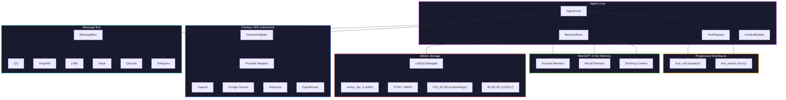

# PicoClaw

A managed fork of [sipeed/picoclaw](https://github.com/sipeed/picoclaw) — an ultra-lightweight AI agent runtime written in Go.

This fork diverges from upstream with its own architectural decisions: vendored LLM SDK, MemGPT-style tiered memory, progressive tool disclosure, and libSQL-native storage with vector search.

Where it makes sense, I will do my best to merge upstream changes back into this fork.

---

## Why This Fork Exists

The upstream PicoClaw project is a solid foundation — a single-binary AI agent that runs on $10 hardware with <10MB RAM. But it has several architectural gaps that limit extensibility:

- **Duplicated type systems** across `pkg/providers` and `pkg/tools`
- **No structured memory** beyond flat markdown files
- **All tools loaded into context** every request (token waste)
- **Hand-rolled LLM provider implementations** with no streaming, retry, or multi-provider support

This fork addresses all of those with a coherent architecture while preserving the original's defining strengths: small binary, low memory, single-process deployment.

## Architecture


```mermaid
flowchart TB
    subgraph AgentLoop["Agent Loop"]
        AL[AgentLoop] --> CB[ContextBuilder]
        AL --> TR[ToolRegistry]
        AL --> MS[MemoryStore]
    end

    subgraph Fantasy["Fantasy SDK (vendored)"]
        FA[FantasyAdapter] --> FP[Provider Registry]
        FP --> OR[OpenRouter]
        FP --> AN[Anthropic]
        FP --> GG[Google Gemini]
        FP --> OA[OpenAI]
    end

    subgraph Progressive["Progressive Disclosure"]
        TR --> TS["tool_search (fuzzy)"]
        TR --> TC["tool_call (dispatch)"]
    end

    subgraph Memory["MemGPT 3-Tier Memory"]
        MS --> WC[Working Context]
        MS --> RC[Recall Memory]
        MS --> AR[Archival Memory]
    end

    subgraph Storage["libSQL Storage"]
        DEL[LibSQLDelegate] --> BLOB["BLOB PK (UUIDv7)"]
        DEL --> F32["F32_BLOB (embeddings)"]
        DEL --> FTS["FTS5 + BM25"]
        DEL --> VEC["vector_top_k (ANN)"]
    end

    subgraph Bus["Message Bus"]
        BUS[MessageBus] --> TG[Telegram]
        BUS --> DC[Discord]
        BUS --> SL[Slack]
        BUS --> LN[LINE]
        BUS --> DT[DingTalk]
        BUS --> QQ[QQ]
    end

    AL --> FA
    MS --> DEL
    AL --> BUS

    style AgentLoop fill:#1a1a2e,stroke:#e066ff,stroke-width:2px,color:#fff
    style Fantasy fill:#1a1a2e,stroke:#4d94ff,stroke-width:2px,color:#fff
    style Progressive fill:#1a1a2e,stroke:#ffab00,stroke-width:2px,color:#fff
    style Memory fill:#1a1a2e,stroke:#2eb82e,stroke-width:2px,color:#fff
    style Storage fill:#1a1a2e,stroke:#ff6b6b,stroke-width:2px,color:#fff
    style Bus fill:#1a1a2e,stroke:#00bfa5,stroke-width:2px,color:#fff
```

### Key Design Decisions

| Decision | Rationale |
|----------|-----------|
| **Vendored Fantasy SDK** | `charm.land/fantasy` vendored into `internal/fantasy/` via `go.mod` replace directive. Enables direct modification for streaming hooks, tool call repair, and progressive disclosure without waiting on upstream releases. |
| **MemGPT 3-tier memory** | Working context (hot), recall items (warm, session-scoped), archival chunks (cold, embedded + indexed). Mirrors the MemGPT paper's approach to bounded-context memory management. |
| **Progressive tool disclosure** | Agent sees only `tool_search` and `tool_call` meta-tools. Discovers actual tools on demand via fuzzy search. Cuts system prompt tokens dramatically for large tool registries. |
| **libSQL over modernc/sqlite** | Native F32_BLOB for vector storage, `libsql_vector_idx` for ANN search, FTS5 for full-text. Single database, no external vector DB dependency. |
| **BLOB primary keys** | 16-byte UUIDv7 stored as BLOB, not 36-byte TEXT. More compact, byte-comparable, monotonically sortable by creation time. |
| **sqlc for type-safe queries** | Generated Go code from SQL. Hand-written SQL only where sqlc can't parse (FTS5 MATCH, vector_top_k). Prepared statement cache for the hand-written queries. |
| **Deleted legacy providers** | Removed all hand-rolled `pkg/providers/` LLM implementations. Fantasy SDK handles provider routing, streaming, retry, and error normalization. |

## What Changed From Upstream

### Added
- `internal/fantasy/` — Vendored Charmbracelet Fantasy SDK (v0.8.1)
- `pkg/fantasy/` — Fantasy adapter layer (converts between PicoClaw and Fantasy types)
- `pkg/memory/` — Full MemGPT memory system (delegate, store, retrieval, chunker, scorer, queue)
- `pkg/cache/` — Generic LRU+TTL cache with stale-while-revalidate and tag invalidation
- `pkg/messages/` — Canonical message types (replaces duplicated type definitions)
- `pkg/ids/` — UUIDv7 generation + BLOB codec
- `pkg/tools/call.go` — `tool_call` meta-tool for progressive disclosure
- `pkg/tools/search.go` — `tool_search` meta-tool with fuzzy matching
- `pkg/memory/delegate/` — libSQL delegate with FTS5, vector search, capability detection, statement cache

### Removed
- Legacy LLM provider implementations (OpenAI, Anthropic, Gemini, DeepSeek, Groq, Zhipu, OpenRouter hand-rolled HTTP clients)
- Duplicated type definitions between `pkg/providers/` and `pkg/tools/`

### Modified
- Agent loop now initializes memory, builds context with working memory, offloads large tool results to archival
- Session manager uses LRU cache with disk-backed eviction
- Tool registry supports progressive disclosure mode
- Config system extended for memory, progressive disclosure, embedding settings

## Project Layout

```
cmd/picoclaw/          # CLI entrypoint (agent, gateway, onboard, status, cron)
internal/fantasy/      # Vendored charm.land/fantasy SDK
pkg/
├── agent/             # Agent loop, context builder, memory integration
├── auth/              # OAuth2 + PKCE for provider auth
├── bus/               # Hub-and-spoke message bus
├── cache/             # Generic LRU+TTL cache
├── channels/          # Telegram, Discord, Slack, LINE, DingTalk, QQ, WeChat, MaixCAM
├── config/            # JSON config with env var overrides
├── constants/         # Channel name constants
├── cron/              # Cron scheduler (gronx-based)
├── devices/           # Hardware device hotplug (USB on Linux)
├── errors/            # Shared error types
├── fantasy/           # Fantasy SDK adapter (provider factory, type conversion)
├── heartbeat/         # Periodic task execution
├── ids/               # UUIDv7 generation + BLOB codec
├── logger/            # Structured logger
├── memory/            # MemGPT memory system
│   ├── delegate/      # libSQL storage backend (FTS5, vector, capabilities)
│   ├── sqlc/          # sqlc config + generated code
│   └── store/         # MemoryStore, retrieval, chunking, scoring, queuing
├── messages/          # Canonical message/tool-call types
├── migrate/           # Config + workspace migration
├── providers/         # Legacy provider types (kept for interface compatibility)
├── session/           # Session manager with LRU disk-backed cache
├── skills/            # Skill loader + installer
├── state/             # Persistent state (last channel, etc.)
├── tools/             # Tool registry, meta-tools, built-in tools
├── utils/             # Media + string helpers
└── voice/             # Groq Whisper voice transcription
skills/                # Built-in skills (weather, tmux, summarize, github, hardware)
config/                # Example configuration files
```

## Quick Start

### Build from source

```bash
git clone https://github.com/ZanzyTHEbar/picoclaw.git
cd picoclaw
make build
```

> **Note:** Requires `CGO_ENABLED=1` — the go-libsql driver ships pre-compiled C binaries linked against glibc.

### Configure

```bash
# Initialize config and workspace
./build/picoclaw onboard
```

Edit `~/.picoclaw/config.json`:

```json
{
  "agents": {
    "defaults": {
      "model": "anthropic/claude-sonnet-4-20250514",
      "max_tokens": 8192,
      "temperature": 0.7,
      "max_tool_iterations": 20
    }
  },
  "providers": {
    "openrouter": {
      "api_key": "sk-or-v1-xxx",
      "api_base": "https://openrouter.ai/api/v1"
    }
  },
  "tools": {
    "progressive_disclosure": true,
    "web": {
      "duckduckgo": { "enabled": true, "max_results": 5 }
    }
  }
}
```

### Run

```bash
# One-shot
picoclaw agent -m "What is 2+2?"

# Interactive REPL
picoclaw agent

# Gateway (Telegram, Discord, etc.)
picoclaw gateway
```

### Docker

```bash
cp config/config.example.json config/config.json
# Edit config.json with your API keys

docker compose --profile gateway up -d
docker compose logs -f picoclaw-gateway
```

## LLM Providers

The Fantasy SDK handles provider routing. Configure any supported provider:

| Provider | Config Key | Notes |
|----------|-----------|-------|
| OpenRouter | `openrouter` | Access to all models via single API key |
| Anthropic | `anthropic` | Claude direct |
| OpenAI | `openai` | GPT direct |
| Google Gemini | `gemini` | Gemini direct |
| Groq | `groq` | Fast inference + Whisper voice transcription |

API key links: [OpenRouter](https://openrouter.ai/keys) · [Anthropic](https://console.anthropic.com) · [OpenAI](https://platform.openai.com) · [Gemini](https://aistudio.google.com/api-keys) · [Groq](https://console.groq.com)

## Chat Channels

| Channel | Setup Complexity |
|---------|-----------------|
| Telegram | Easy — single bot token |
| Discord | Easy — bot token + message content intent |
| QQ | Easy — AppID + AppSecret |
| DingTalk | Medium — app credentials |
| LINE | Medium — credentials + webhook URL |
| Slack | Medium — app credentials + event subscriptions |

See the channel configuration sections below for setup details.

<details>
<summary><b>Telegram</b></summary>

1. Create bot via `@BotFather` on Telegram, copy token
2. Get your user ID from `@userinfobot`
3. Configure:

```json
{
  "channels": {
    "telegram": {
      "enabled": true,
      "token": "YOUR_BOT_TOKEN",
      "allowFrom": ["YOUR_USER_ID"]
    }
  }
}
```

4. Run `picoclaw gateway`
</details>

<details>
<summary><b>Discord</b></summary>

1. Create application at https://discord.com/developers/applications
2. Create bot, copy token, enable MESSAGE CONTENT INTENT
3. Get your User ID (Developer Mode → right-click avatar → Copy User ID)
4. Configure:

```json
{
  "channels": {
    "discord": {
      "enabled": true,
      "token": "YOUR_BOT_TOKEN",
      "allowFrom": ["YOUR_USER_ID"]
    }
  }
}
```

5. Invite bot: OAuth2 → URL Generator → Scopes: `bot` → Permissions: `Send Messages`, `Read Message History`
6. Run `picoclaw gateway`
</details>

<details>
<summary><b>QQ</b></summary>

1. Create application at [QQ Open Platform](https://q.qq.com/#)
2. Configure:

```json
{
  "channels": {
    "qq": {
      "enabled": true,
      "app_id": "YOUR_APP_ID",
      "app_secret": "YOUR_APP_SECRET",
      "allow_from": []
    }
  }
}
```

3. Run `picoclaw gateway`
</details>

<details>
<summary><b>DingTalk</b></summary>

1. Create internal app at [DingTalk Open Platform](https://open.dingtalk.com/)
2. Configure:

```json
{
  "channels": {
    "dingtalk": {
      "enabled": true,
      "client_id": "YOUR_CLIENT_ID",
      "client_secret": "YOUR_CLIENT_SECRET",
      "allow_from": []
    }
  }
}
```

3. Run `picoclaw gateway`
</details>

<details>
<summary><b>LINE</b></summary>

1. Create Messaging API channel at [LINE Developers Console](https://developers.line.biz/)
2. Configure:

```json
{
  "channels": {
    "line": {
      "enabled": true,
      "channel_secret": "YOUR_CHANNEL_SECRET",
      "channel_access_token": "YOUR_CHANNEL_ACCESS_TOKEN",
      "webhook_host": "0.0.0.0",
      "webhook_port": 18791,
      "webhook_path": "/webhook/line",
      "allow_from": []
    }
  }
}
```

3. Set up HTTPS webhook (e.g., `ngrok http 18791`) and configure the URL in LINE console
4. Run `picoclaw gateway`
</details>

## Memory System

PicoClaw implements a 3-tier MemGPT-inspired memory system:

| Tier | Purpose | Storage | Search |
|------|---------|---------|--------|
| **Working Context** | Current focus, active goals | Single JSON document per agent | Direct load |
| **Recall Memory** | Session-scoped conversation items | Rows with metadata + timestamps | FTS5 + BM25 |
| **Archival Memory** | Long-term knowledge, chunked + embedded | F32_BLOB embeddings + FTS5 index | Vector ANN + FTS5 fusion (RRF) |

The agent interacts with memory through a unified `memory` tool that supports search, read, write, update, delete, and status operations. Large tool results are automatically offloaded to archival memory.

Retrieval uses Reciprocal Rank Fusion (RRF) to combine vector similarity and full-text relevance, with recency decay and metadata pre-filtering.

## Scheduled Tasks

PicoClaw supports cron-based scheduling and heartbeat-driven periodic tasks:

```bash
picoclaw cron list          # List scheduled jobs
picoclaw cron add ...       # Add a scheduled job
```

The heartbeat system reads `~/.picoclaw/workspace/HEARTBEAT.md` every 30 minutes (configurable) and executes listed tasks. Long-running tasks can be delegated to subagents via the `spawn` tool.

## CLI Reference

| Command | Description |
|---------|-------------|
| `picoclaw onboard` | Initialize config and workspace |
| `picoclaw agent -m "..."` | One-shot chat |
| `picoclaw agent` | Interactive REPL |
| `picoclaw gateway` | Start message bus gateway |
| `picoclaw status` | Show system status |
| `picoclaw cron list` | List scheduled jobs |
| `picoclaw cron add ...` | Add a scheduled job |

## Security Sandbox

The agent runs in a sandboxed environment by default. File and command access is restricted to the configured workspace (`~/.picoclaw/workspace`).

| Setting | Default | Description |
|---------|---------|-------------|
| `restrict_to_workspace` | `true` | Restrict all file/exec operations to workspace |

The `exec` tool blocks dangerous commands (bulk deletion, disk formatting, fork bombs, shutdown) regardless of sandbox setting.

To disable workspace restriction:

```json
{ "agents": { "defaults": { "restrict_to_workspace": false } } }
```

Or: `export PICOCLAW_AGENTS_DEFAULTS_RESTRICT_TO_WORKSPACE=false`

## Development

```bash
make build          # Build for current platform
make build-all      # Cross-compile (linux/amd64, linux/arm64, linux/riscv64, darwin/arm64, windows/amd64)
make install        # Install to ~/.local/bin + copy skills
make fmt            # go fmt ./...
make deps           # go get -u + go mod tidy
make clean          # Remove build artifacts
```

### sqlc

Memory queries are generated by sqlc. After modifying SQL files:

```bash
cd pkg/memory/sqlc && sqlc generate
```

### Syncing Upstream

```bash
git remote add upstream git@github.com:sipeed/picoclaw.git
git fetch upstream
git merge upstream/main
```

See `internal/fantasy/VENDORING.md` for syncing the vendored Fantasy SDK.

## Upstream

This is a fork of [sipeed/picoclaw](https://github.com/sipeed/picoclaw), originally inspired by [nanobot](https://github.com/HKUDS/nanobot). The upstream project targets $10 RISC-V hardware with <10MB RAM — a constraint this fork respects while extending the agent's cognitive architecture.

## License

MIT — see [LICENSE](LICENSE).
