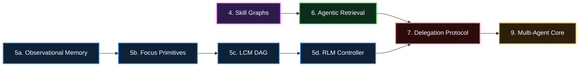

# DragonScale Roadmap

> **Vision**: Ultra-lightweight, secure, fully autonomous AI agent infrastructure.
> Automate the mundane, unleash your creativity.

---

## Unified Kernel Plan Status (2026-02)

Reference blueprint: `docs/execution/unified-kernel-blueprint.md`

- [x] Single always-on runtime path (SecureBus + offloading + run-state persistence).
- [x] Fail-fast boot invariants for kernel dependencies.
- [x] Deterministic session continuity with projection pointers + integrity validation.
- [x] Emergency-only recursive compression and provenance persistence.
- [x] Persistent DAG snapshots + lossless DAG tools (`dag_expand`, `dag_describe`, `dag_grep`).
- [x] Subagent runtime parity with delegation scope/lineage/depth/fanout guardrails.
- [x] Assistant-focused proactive eval suite (commitments/reminders/follow-ups/continuity).
- [x] Legacy backfill for session projection pointers and missing DAG snapshots.
- [x] Next phase delivered: dual-state memory contracts, map operators, obligation engine, hybrid retrieval router, shadow-mode proof gates, promotion-on-win, and fast rollback.
- [x] Map operators are now FlatBuffers-first end to end for persisted run/item state (`spec_fb`, `input_fb`, `output_fb`).
- [x] Worker identity and deduplication for map jobs now resolve via deterministic keys (`map:{runID}:{itemIndex}`), with idempotent run reuse under concurrency.
- [x] Devcontainer + `flatc` + `sqlc` generation pipeline is active (`make devcontainer-build`, `make devcontainer-up`, `make devcontainer-generate`, `make devcontainer-verify`).

---

## 1. Core Optimization

*< 20MB on 64MB RAM embedded boards. RAM > binary size.*

- **Memory footprint reduction** — Profile per-release, strip redundant deps, optimize data structures.

---

## 2. Security Hardening

- **Prompt injection defense** — Harden JSON extraction against LLM manipulation.
- **Tool abuse prevention** — Strict parameter validation, command boundary enforcement.
- **SSRF protection** — Blocklists for internal IPs (LAN/metadata).
- **Filesystem sandbox** — Restrict R/W to configured workspace.
- **Context isolation** — No data leakage between sessions/channels.
- **Privacy redaction** — Auto-strip API keys, PII from logs.
- **Crypto upgrade** — `ChaCha20-Poly1305` for secret storage.
- **OAuth 2.0 flow** — Replace hardcoded API keys.

---

## 3. Connectivity

- **Protocol-first providers** — Classify by protocol (OpenAI-compatible, Ollama-compatible), not vendor.
- **Local inference** — Ollama, vLLM, LM Studio, Mistral.
- **Channel matrix** — Telegram, Discord, QQ, WeChat, DingTalk, Feishu, WhatsApp, LINE, Slack, Email, Signal, KOOK.
- **OneBot support** — Standard IM protocol.
- **Attachments** — Native image, audio, video handling.

---

## 4. Skill Graphs

*Single skill files can't hold domain depth. Skill graphs solve this.*

A skill graph is a network of skill files connected with `[[wikilinks]]`. Each node is one complete thought/technique/skill. Links carry meaning because they're woven into prose. The agent follows relevant paths, skips what doesn't matter.

- **Wikilink resolution in `SkillsLoader`** — Parse `[[skill-name]]` links in skill markdown. Resolve to file paths. Expose link targets to the agent without loading full content.
- **YAML frontmatter scanning** — Agent reads `description` fields from frontmatter to decide relevance before loading file bodies. Already partially implemented; extend to support `links`, `tags`, `domain` fields.
- **Maps of Content (MOCs)** — Special skill files that organize clusters of related skills into navigable sub-topics. MOC index → skill descriptions → wikilinks → sections → full content.
- **Progressive skill disclosure** — Mirror the existing tool disclosure pattern: `skill_search` (fuzzy match on name/description/tags) → `skill_read` (load specific node) → `skill_traverse` (follow a wikilink chain). Most decisions happen before reading a single full file.
- **Skill graph index** — Root `INDEX.md` per skill graph that maps the landscape. Agent reads the index, understands topology, follows links relevant to the current task.
- **Recursive graph traversal** — Same skill discovery pattern applies recursively inside the graph. Every node has a scannable description; every wikilink carries contextual meaning.
- **Domain skill graph templates** — Starter graphs for common domains: trading (risk mgmt, market psychology, position sizing, technical analysis), legal (contract patterns, compliance, jurisdiction, precedent chains), company (org structure, product knowledge, processes, onboarding).

*Extends*: `pkg/skills/loader.go` — currently flat directory scan → add graph-aware traversal.

---

## 5. Context Management

*The agent loop currently appends forever. These features give it autonomy over its own context window.*

### 5a. Observational Memory

*Ref: Mastra OM — 94.87% LongMemEval, text-based, prompt-cacheable.*

Compress raw conversation into prioritized observations. Two-block context: observations (stable prefix, cacheable) + uncompressed tail (append-only until threshold).

- **Observer agent** — When uncompressed messages hit configurable token threshold (default 30K), a background pass compresses them into observation entries appended to the observation block. Format: `DATE EMOJI TIMESTAMP observation_text`. Emoji encodes priority: critical / notable / informational.
- **Reflector agent** — When observations hit their own threshold (default 40K), garbage-collect low-priority observations. Infrequent; only time the full cache invalidates.
- **Three-date model** — Each observation carries: observation date, referenced date, relative date. Improves temporal reasoning.
- **Prompt cache alignment** — Observation block is a stable prefix. Messages append until threshold → full cache hit every turn. Observation run → partial cache hit. Reflection → full invalidation (rare).
- **Async observation** — Observation runs outside the conversation loop in a background goroutine. Conversation doesn't block.

*Extends*: `pkg/memory/store/` — new `ObservationStore` alongside existing 3-tier MemGPT.

### 5b. Focus Primitives

*Ref: Focus (arxiv 2601.07190) — slime mold-inspired autonomous context pruning. 22.7% token reduction, identical accuracy.*

Give the agent two new tool primitives: `start_focus` and `complete_focus`. The agent autonomously decides when to consolidate learnings and prune raw history.

- **`start_focus` tool** — Agent declares what it's investigating. Creates a checkpoint marker in the context.
- **`complete_focus` tool** — Agent summarizes: what was attempted, what was learned, outcome. System appends summary to persistent Knowledge block, deletes everything between the checkpoint and current step.
- **Sawtooth context pattern** — Context grows during exploration, collapses during consolidation. Converts monotonic growth into bounded oscillation.
- **Aggressive prompting** — System prompt instructs the agent to consolidate every 10-15 tool calls. Passive prompting yields only 6% savings; explicit instructions yield 40%+.

*Extends*: `pkg/tools/` — new `focus.go` with `start_focus`/`complete_focus` tools. `pkg/agent/loop.go` — checkpoint/prune logic.

### 5c. Lossless Context Management (LCM)

*Ref: Volt (papers.voltropy.com/LCM) — +29.2 pts avg on OOLONG, beats Claude Code at every context length 32K–1M.*

Deterministic engine compresses old messages into a hierarchical DAG while keeping lossless pointers to every original. No model autonomy over memory scripts — the compression engine is deterministic.

- **Hierarchical DAG** — Messages compress into tree nodes. Each node stores a summary + pointers to original messages. Multiple compression levels: raw → chunk summary → section summary → session summary.
- **Lossless pointers** — Every compressed node retains byte-offset pointers to original content in the session store. Agent can "zoom in" on any summary to retrieve the original messages on demand.
- **Deterministic compression** — No LLM call in the compression path. Use extractive summarization + token counting heuristics. Predictable, reproducible, auditable.
- **Context budget allocation** — Given a context window size, allocate tokens across: system prompt, observations, DAG summaries, raw tail, tool results. Each category has a configurable max percentage.

*Extends*: `pkg/memory/` — new `dag/` package. `pkg/agent/context.go` — context budget allocator.

### 5d. RLM Memory Controller

*Dedicated controller layer for Memory I/O — optimizes token usage, call frequency, read/write scheduling.*

- **Read coalescing** — Batch multiple memory reads into a single DB round-trip. Reduce I/O calls per agent loop iteration.
- **Write buffering** — Buffer memory writes and flush on consolidation boundaries (aligned with Focus checkpoints).
- **Token budget enforcement** — Hard cap on tokens loaded from memory per turn. Controller decides what to fetch given the budget, using importance scores from the existing scoring pipeline.
- **Adaptive fetch** — Controller adjusts retrieval depth based on task complexity signal (number of tool calls, error rate, context pressure).
- **Recursive Language Models**: Utilize a full in-process RLM agent system to manage the memory store.

*Extends*: `pkg/memory/store/` — new `Controller` layer wrapping `MemoryStore`.

---

## 6. Agentic Retrieval (A-RAG)

*Ref: arxiv 2602.03442 — 94.5% HotpotQA, 50% fewer tokens than naive RAG.*

*The agent decides what to search, how to search, and when to stop.*

Currently retrieval is a single `memory search` call. A-RAG exposes hierarchical retrieval interfaces and lets the agent reason about which to use.

- **`keyword_search` tool** — Exact lexical matching via FTS5 + BM25. Fast, precise. Already exists in delegate; promote to agent-visible tool.
- **`semantic_search` tool** — Dense passage retrieval via vector ANN. Already exists; promote to agent-visible tool with explicit control over top-k, threshold.
- **`chunk_read` tool** — Load full document/chunk content by ID. Agent follows up after search to read specific chunks. Avoids loading irrelevant content.
- **Agent-driven retrieval loop** — Agent autonomously chains: keyword_search → filter → semantic_search → chunk_read. Decides when evidence is sufficient to answer.
- **Test-time compute scaling** — Allow configurable max retrieval steps (default 10). More steps = higher accuracy at higher cost. Agent stops early when confident.
- **Context efficiency** — Hierarchical design yields ~50% token reduction vs. single-shot retrieval with higher accuracy.

*Extends*: `pkg/tools/` — new `retrieval.go` exposing keyword_search, semantic_search, chunk_read. `pkg/memory/delegate/` — already has the primitives; wire them as agent-callable tools.

---

## 7. Intelligent Delegation Protocol

*Ref: Google DeepMind "Intelligent AI Delegation" — delegation as protocol, not prompt.*

Current multi-agent: agent A spawns agent B. No formal responsibility structure. These items build enterprise-grade delegation.

- **Dynamic capability assessment** — Before delegating, evaluate: delegatee capability, resource availability, risk, cost, verifiability, reversibility. Store capability profiles per agent/model in the KV store.
- **Adaptive re-assignment** — Monitor delegatee progress. If underperforming (latency, error rate, quality signal), reassign mid-execution to a different agent or escalate to human.
- **Audit log** — Append-only structured log of every delegation: who delegated, to whom, task description, constraints, outcome, verification status. Already have `agent_audit_log` table; extend schema for delegation events.
- **Verifiable completion** — Delegatee must prove what it did. Completion report includes: actions taken, artifacts produced, verification evidence. Delegator validates before accepting.
- **Trust calibration** — Maintain per-agent trust scores based on historical delegation outcomes. Over-trust (auto-accept everything) and under-trust (re-do everything) are both failure modes. Calibrate dynamically.
- **Bounded authority** — Delegation carries explicit permission scopes. Delegatee cannot exceed the permission boundary of its delegator. Enforced at the tool registry level.
- **Resilience** — Avoid monoculture: don't route all delegations to the same model. Diversify across providers. Circuit-breaker on provider failures.

*Extends*: `pkg/agent/loop.go` (spawn/subagent logic), `pkg/memory/sqlc/queries/agent_audit_log.sql`, `pkg/tools/` (delegation tools).

---

## 8. Operations

- **MCP support** — Native Model Context Protocol integration.
- **Browser automation** — Headless CDP / ActionBook.
- **Mobile operation** — Android device control.

---

## 9. Multi-Agent Core

- **Model routing** — Small/local models for easy tasks, SOTA for hard ones.
- **Swarm mode** — Multi-instance collaboration on LAN.
- **AIEOS** — AI-native OS interaction paradigms.

---

## 10. Developer Experience

- **Zero-config wizard** — Interactive CLI onboarding.
- **Platform guides** — Windows, macOS, Linux, Android.
- **AI-assisted docs** — Auto-generated API references with human verification.

---

## 11. Engineering

- **AI-enhanced CI/CD** — Automated code review, linting, PR labeling.
- **Issue triage** — AI agents analyze incoming issues, suggest fixes.

---

## 12. Brand & Community

- **Logo** — Mantis Shrimp. Small but mighty. Lightning fast strikes.

---

### Dependency Graph

### Priority Order

| Phase | Items | Rationale |
|-------|-------|-----------|
| **P0** | Observational Memory, Focus Primitives, Skill Graphs | Immediate token savings + domain depth. Builds on existing `pkg/memory/` and `pkg/skills/`. |
| **P1** | Agentic Retrieval, LCM DAG, Audit Log | Unlocks agent-driven knowledge navigation and context scaling. |
| **P2** | RLM Controller, Delegation Protocol, Trust Calibration | Full autonomous delegation requires the memory + retrieval foundations from P0/P1. |

### References

- Skill Graphs: [arscontexta](https://github.com/arscontexta) — 249-file skill graph for knowledge systems
- Observational Memory: [Mastra OM](https://mastra.ai) — 94.87% LongMemEval, text-based, prompt-cacheable
- Lossless Context Management: [Volt/LCM](https://papers.voltropy.com/LCM) — +29.2 avg on OOLONG benchmark
- Focus Primitives: [arxiv 2601.07190](https://arxiv.org/abs/2601.07190) — Physarum-inspired autonomous context pruning
- Agentic RAG: [arxiv 2602.03442](https://arxiv.org/abs/2602.03442) — 94.5% HotpotQA, hierarchical retrieval
- Intelligent Delegation: [Google DeepMind](https://arxiv.org/abs/2510.26493) — delegation as protocol, not prompt

## Ideas and improvements

- [ ] Add performance metrics to the eval harness
  - [ ] Raw metrics of tool calls, LLM calls, token counts, duration, etc
  - [ ] Per-test scores
  - [ ] Side-by-side comparison matrix
  - [ ] Compare to other agent runtimes
- [ ] Compare to upstream origin implementation
  - [ ] What benchmarks should we be running?
  - [ ] What are the key performance metrics we should be tracking?
- [ ] Add a new tool for the agent to use: `focus_search`
- [ ] Clean up the main.go and extract to modules
- [ ] Create a pure Application API that I/O calls into
  - [ ] I/O adapters should be pluggable; kernel execution path remains single and always-on
    - [ ] cli
    - [ ] daemon
    - [ ] web
    - [ ] grpc
    - [ ] http
    - [ ] websocket
    - [ ] tcp
    - [ ] udp
    - [ ] serial
    - [ ] i2c
    - [ ] spi
    - [ ] pwm
    - [ ] etc
- [ ] Migrate to Cobra CLI framework
  - [ ] Use command-palette pattern for subcommands
  - [ ] keep cli commands as pure cli that calls into the application
- [ ] Migrate to errbuilder-go (ZanzyTHEbar)
- [ ] Migrate to assert-lib (ZanzyTHEbar)
- [ ] Implement SubAgent Profiles
  - [ ] SubAgent Profiles are a way to define the behavior of a subagent:
    - [ ] Tools & Skills to use
    - [ ] Models to use
    - [ ] Configuration
    - [ ] etc.
- [ ] Adopt agentfs
  - [ ] Migrate away from the custom file system and use agentfs instead
  - [ ] Keep our same sandboxing and permissions model, but use agentfs to enforce it
  - [ ] Use clever engineering for optimum performance
    - [ ] Users can still upload files to the agent's workspace, but they will be stored in the agentfs namespace and not the main filesystem
    - [ ] Agentfs supports POSIX operations
      - [ ] Support further:
        - [ ] .oc-nodes, .oc-temp, etc.
        - [ ] Support proper NFS
  - [ ] https://grok.com/share/bGVnYWN5LWNvcHk_311a0d3d-0dec-4af1-943a-bbd18f7d4fec
- [ ] Consolidate tool signatures: 
  - [ ] fold tools that operate on the same data into a single tool with a "mode"/"action"/"event" parameter
  - [ ] move the "mode"/"action"/"event" parameter to the beginning of the tool signature
  - [ ] add a "description" field to the tool signature
  - [ ] this reduces the number of tools and makes the tool signatures more consistent
  - [ ] Tools can then live in packages like `pkg/tools/filesystem.go` and `pkg/tools/network.go`  where we expose only a limited ABI/API to the agent loop
- [ ] Extract out all inline prompts into separate files
  - [ ] Use dotprompt, poml, or any other structured prompt builder to build prompts
- [ ] Isolated tool runtime + DAG executor + RLM engine — see [ADR-001](docs/adr/001-isolated-tool-runtime.md)
  - [ ] Layer 1: Capability manifests (`CapableTool` interface)
  - [ ] Layer 2: SecureBus + FlatBuffers command protocol (incl. DAG types) + leak scanning
  - [ ] DAG executor: LLMCompiler-style parallel dispatch, topological wave execution, dependency resolution, Joiner synthesis, replanning loop
  - [ ] Programmatic tool calling: PTC-style context isolation (intermediate results never enter LLM context), ToolSearch for on-demand tool discovery
  - [ ] RLM engine: recursive context decomposition (rope DS, parallel fan-out, cheap sub-LM strategy, recursive DAG expansion)
  - [ ] ReAct/DAG routing: automatic mode selection (`ModeReAct | ModeDAG | ModeAuto`)
  - [ ] Layer 3: SecretStore + keyring-based secret management
  - [ ] Layer 4: Daemon mode + Schnorr ZKP authentication
  - [ ] Layer 5: wazero WASM isolates (pure Go, no CGO), `CodeExec` command variant
- [ ] Plug-in tool support: `pkg/tools/registry.go` — add `Search(query) []ToolInfo` for ToolSearch
  - [ ] Allow tools to be built as Go plugins
  - [ ] Allow tools to be built as WASM modules
  - [ ] Load tools from the filesystem or network
  - [ ] Tool discovery: `ToolSearch` command variant
  - [ ] Dynamic tool registration: `RegisterTool(Tool)` function
    - [ ] Event-based tool discovery: tool registration triggers `ToolDiscovery` event
    - [ ] Tools have a manifest: `ToolInfo` struct with name, description, capabilities, metadata
- [ ] Since entire agent is sqlite based, we can export the entire state of the agent as a single sqlite database and import it back in to a new agent instance
  - [ ] This would allow for easy backup and restore of the agent's state
  - [ ] This would allow for easy migration of the agent's state between different machines
  - [ ] This would allow for easy sharing of the agent's state with other agents
  - [ ] With clever planning, we could even have a "snapshot" of the agent's state at a given time and then restore to that snapshot later
    - [ ] This would allow for easy rollback of the agent's state to a previous version
    - [ ] Replay, snapshot, restore, etc.
    - [ ] As well as a "diff" of the agent's state between two snapshots
    - [ ] Advanced learning features become available
    - [ ] We could even have a "learn" mode where the agent learns from the state of the world and then saves the state of the world to the database
    - [ ] We could even have "learn" and "teach" modes where we can "download" and "upload" knowledge and trajectories across agents from learned experiences (trajectories, memories, etc.)
      - [ ] Would need to ensure no PII in the state is exported or imported