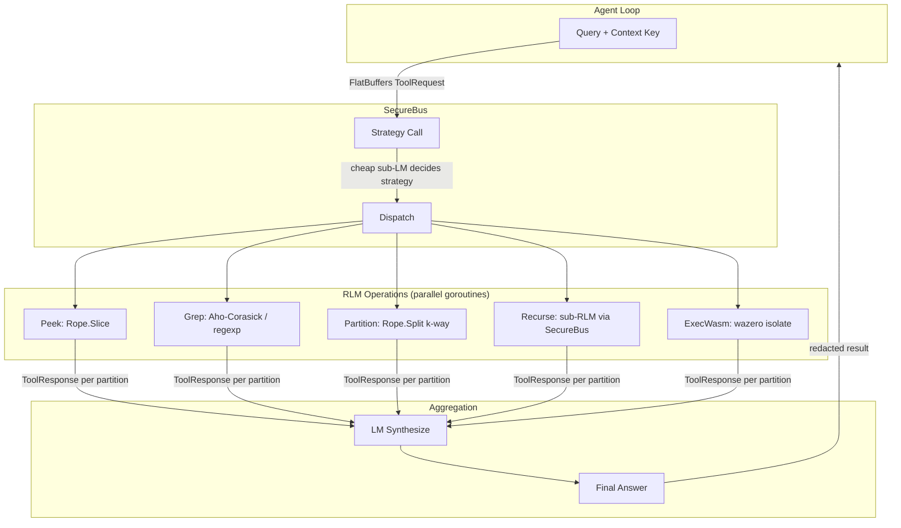
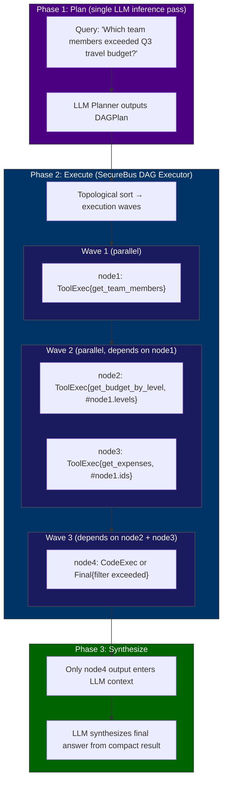

# ADR-001: Isolated Tool Runtime (ITR) + DAG Task Executor

**Date**: 2026-02-18 (updated 2026-02-19)
**Status**: Accepted (incremental rollout)
**Authors**: @ZanzyTHEbar

---

## Current Rollout Status

This ADR mixes shipped kernel behavior with the longer-range secure execution roadmap.

### Live in production

- Layer 1-2 SecureBus mediation is active for tool execution.
- FlatBuffers command vocabulary is live for the internal command surface.
- Recursion-depth policy validation, `arg:` secret injection, leak scanning, and audit logging are on the hot path.
- Dependency-aware parallel tool execution is active through the DAG tool runtime.
- `pkg/rlm` is now wired into active-context assembly as a reducer for oversized DAG / recall / archival projection segments.

### Still planned

- Daemon-mode SecureBus separation and Schnorr ZKP session establishment.
- wazero-backed isolated execution for untrusted tools.
- Full DAG-planner-time recursive RLM expansion through SecureBus as the universal long-context backbone.

## Context

DragonScale tools execute in-process with the agent loop. The `Vault` (XChaCha20-Poly1305) encrypts secrets at rest, the SecureBus performs `arg:` secret injection for declared secret refs, and the redaction path scans LLM-facing tool output before it reaches the agent loop. The stronger privilege-boundary roadmap in this ADR still matters because broader network/filesystem policy enforcement, daemon separation, and WASM isolation are not yet fully shipped.

A compromised tool — via prompt injection, malicious skill, or supply chain attack — has the same memory-space access as the agent itself. This is the same class of vulnerability that led to the OpenClaw token exfiltration incident (Feb 2026), where malicious skills on ClawHub could read API keys from the host environment and exfiltrate them through tool output.

Competing frameworks have responded:

- **IronClaw** (NEAR AI, Rust): WASM container isolation, capability-based permissions, encrypted credential vault with runtime injection, network interception for leak detection.
- **WyrmLock** (ZanzyTHEbar, Rust): ZKP-based application locking via proc connector, cryptographic authentication before process execution, system keyring integration.

DragonScale's constraint is unique: the binary must remain under 20MB and run on 64MB RAM embedded boards. A full WASM runtime or separate daemon process is not viable as a mandatory dependency. The solution must be **progressive** — lightweight in-process enforcement by default, with optional heavier isolation for richer platforms.

**RLM convergence**: Independently, Recursive Language Models (Zhang & Khattab, MIT CSAIL, Oct 2025; arXiv:2512.24601 v2) demonstrate that long-context systems suffer from "context rot" — performance degrades as context length grows, not from technical limits but from information overload and distributional mismatch. RLM's solution is **context-as-variable** + **recursive decomposition**: the LM never sees the full context directly. Instead, it interacts with context through structured operations (peek, grep, partition, recurse) in a REPL-like environment, spawning recursive sub-calls over partitioned subsets.

RLM(GPT-5-mini) outperforms base GPT-5 by 114% on hard long-context tasks (OOLONG benchmark, 263k tokens) while maintaining roughly equivalent cost. At 10M+ tokens (1000 documents, BrowseComp-Plus), RLM maintains perfect performance where standard approaches collapse entirely.

The architectural insight that connects these two concerns: **RLM recursive calls are tool calls**. Every `peek`, `grep`, `partition`, `recurse`, and `exec_wasm` operation is a tool invocation. These operations are the highest-risk execution path in the system because they involve LM-generated commands (prompt injection vector), process
potentially sensitive context (data exfiltration vector), and spawn sub-calls that could compound attacks (recursive privilege escalation). 

The ITR's SecureBus is therefore not just a security layer — it is the RLM execution backbone. The two systems converge into one architecture.

**DAG executor convergence**: Three independent developments in AI tool orchestration address the same fundamental bottleneck — sequential, token-expensive tool execution — from complementary angles:

1. **LLMCompiler** (Kim et al., ICML 2024; arXiv:2312.04511): Treats multi-tool workflows like a compiler, constructing a Directed Acyclic Graph (DAG) of tool calls with explicit dependencies in a **single LM inference pass**, then executing nodes in topological order with parallel dispatch. Results: 3.7x latency speedup, 6.7x cost savings, ~9% accuracy improvement over ReAct. The extended **LLM-Tool Compiler** (arXiv:2405.17438) adds runtime operation fusion, achieving 4x more parallel calls and 40% token reduction.

2. **Anthropic Programmatic Tool Calling (PTC)** (Nov 2025): The LM writes orchestration code that calls multiple tools within a sandboxed execution environment. Tool results flow through the sandbox — **intermediate results never enter the LM's context**. Only the final/aggregated output is returned. Results: 37% token reduction on complex research tasks, 19+ inference passes eliminated per multi-tool workflow. Internal knowledge retrieval improved from 25.6% to 28.5%; GIA benchmarks from 46.5% to 51.2%.

3. **RLM** (already described above): Unbounded context via recursive decomposition.

These three systems compose naturally: **the LLMCompiler DAG planner produces the execution plan, the SecureBus DAG executor dispatches nodes in parallel with PTC-style context isolation, and the RLM engine activates when any node's context exceeds the LM's window**. DragonScale's current agent loop (`RunToolLoop`) uses Fantasy's ReAct pattern — each tool call requires a full inference pass, and all intermediate results accumulate in context. The DAG executor replaces this sequential loop for complex multi-tool workflows while preserving ReAct for simple cases.

**Anthropic Tool Search** (Nov 2025): Separately, Anthropic's Tool Search Tool demonstrates that loading all tool definitions upfront (55K+ tokens for a modest 5-server setup) is itself a form of context pollution. On-demand tool discovery reduces token consumption by 85% while improving accuracy (Opus 4: 49% → 74%). This maps directly to a `ToolSearch` command variant in our FlatBuffers schema, enabling the DAG planner to discover tools lazily rather than seeing all definitions.

### Forces

- **Security**: The LLM must never see raw secrets. Tool output must be scanned for leaks before reaching the agent loop.
- **Context rot**: Long-context performance degrades with scale. The agent needs structured, recursive context decomposition — but those recursive operations must be isolated and mediated.
- **Token efficiency**: Sequential tool calling wastes inference passes and pollutes context with intermediate results. Multi-tool workflows should execute in parallel where dependencies allow, with only final results entering the LM's context.
- **Embedded constraint**: < 20MB binary, 64MB RAM. No mandatory CGO, no mandatory external daemon.
- **Backward compatibility**: Existing tools must continue working without modification. Security improvements are opt-in per tool.
- **Auditability**: Every tool execution, secret access, and leak detection must be logged.
- **Extensibility**: The architecture must accommodate WASM isolation, daemon-mode separation, RLM recursive decomposition, and DAG-based parallel execution without redesign.

---

## Decision

Introduce a **layered Isolated Tool Runtime (ITR)** with five progressive layers. Layers 1-2 are mandatory (P0). Layers 3-5 are opt-in, gated behind build tags or deployment configuration.

### Layer 1: Capability Manifests

Every tool may declare its security requirements through a new `CapableTool` interface. Tools that do not implement it receive **zero capabilities** (no secrets, no network beyond SSRF-validated URLs, filesystem restricted to workspace read-only, no shell).

```go
type CapableTool interface {
    Tool
    Capabilities() ToolCapabilities
}

type ToolCapabilities struct {
    Secrets    []SecretRef
    Network    []EndpointRule
    Filesystem []PathRule
    Shell      ShellAccessLevel
}

type SecretRef struct {
    Name     string // logical name, e.g. "github_token"
    InjectAs string // "env:GITHUB_TOKEN" | "arg:token" | "header:Authorization"
    Required bool
}

type EndpointRule struct {
    Pattern string // URL glob, e.g. "https://api.github.com/**"
}

type PathRule struct {
    Pattern string // relative to workspace root
    Mode    string // "r" | "w" | "rw"
}

type ShellAccessLevel int

const (
    ShellNone      ShellAccessLevel = iota
    ShellDenylist                          // default: block known-dangerous patterns
    ShellAllowlist                         // only explicitly permitted commands
)
```

**Rationale**: Capability declarations are static metadata — zero runtime cost. They enable the SecureBus (Layer 2) to enforce least-privilege without per-tool code changes. Tools that predate the interface get the most restrictive default.

### Layer 2: SecureBus — Privilege Boundary

A new `SecureBus` mediates **all** tool execution. The agent loop no longer calls `ToolRegistry.ExecuteWithContext()` directly — it submits requests to the SecureBus, which enforces policy, injects secrets, executes the tool, scans output, and logs the audit trail.

```
Agent Loop
    │
    │  ToolRequest{name, args}
    ▼
┌──────────────────────────────┐
│         SecureBus            │
│                              │
│  1. Extract capabilities     │
│  2. Validate against policy  │
│  3. Decrypt + inject secrets │
│  4. Execute tool             │
│  5. Scan output for leaks    │
│  6. Write audit log          │
│                              │
└──────────────────────────────┘
    │
    │  ToolResponse{result, redacted}
    ▼
Agent Loop (never sees raw secrets)
```

**Key component**: The `Transport` interface abstracts the communication channel between the agent loop and the SecureBus. In-process, this is a pair of Go channels (`ChannelTransport`). In daemon mode (Layer 4), it becomes a Unix domain socket (`SocketTransport`). The SecureBus code is identical in both cases.

```go
type Transport interface {
    Send(ctx context.Context, req ToolRequest) (ToolResponse, error)
    Close() error
}

type ChannelTransport struct { /* Go channels, in-process */ }
type SocketTransport  struct { /* Unix domain socket, daemon mode */ }
type WasmTransport   struct { /* wazero isolate, untrusted tools */ }
```

**Command protocol**: Tool requests use a structured, schema-enforced format rather than free-form JSON. FlatBuffers (google/flatbuffers, zero-copy serialization) defines the canonical `ToolRequest` schema, covering both traditional tool calls and RLM recursive operations:

```flatbuffers
namespace dragonscale.itr;

// --- Individual command types ---
table Peek      { start: uint64; length: uint32; }
table Grep      { pattern: string; max_matches: uint32; case_insensitive: bool; }
table Partition  { k: uint32; method: string; overlap: uint32; semantic: bool; }
table Recurse   { sub_query: string; context_key: string; depth_hint: uint8; }
table ToolExec  { tool_name: string; args_json: string; }
table ExecWasm  { module_key: string; entry: string; }
table Final     { answer: string; var_name: string; }
table ToolSearch { query: string; max_results: uint8; }
table CodeExec  { code: string; language: string; }  // opt-in only, wazero-isolated

// --- DAG types (LLMCompiler convergence) ---
table DAGNode {
    id:         string;
    payload:    CommandPayload;
    depends_on: [string];         // node IDs this depends on; #nodeN in args resolve to output
}

table DAGPlan {
    nodes:        [DAGNode];
    max_parallel: uint8;          // concurrency limit (default: GOMAXPROCS)
    token_budget: uint32;         // total token budget for the plan
    joiner_query: string;         // synthesis prompt for final aggregation
}

union CommandPayload { Peek, Grep, Partition, Recurse, ToolExec, ExecWasm,
                       Final, ToolSearch, CodeExec, DAGPlan }

table ToolRequest {
    id:          string;
    payload:     CommandPayload;
    timestamp:   uint64;
    depth:       uint8;
    session_key: string;
}

table ToolResponse {
    id:          string;
    result:      string;
    is_error:    bool;
    leak_detected: bool;
    cost_tokens: uint32;
}
```

This schema serves four purposes: (1) zero-copy reads eliminate serialization overhead on the hot path, (2) the union type prevents malformed requests — the LLM cannot construct a request outside the defined vocabulary, (3) the same binary format works across all transports (channels, sockets, WASM host calls), and (4) `DAGPlan` is itself a `CommandPayload` variant, enabling recursive DAG expansion (a node in one DAG can contain a sub-DAG). Traditional tool calls use `ToolExec`; RLM operations use `Peek` / `Grep` / `Partition` / `Recurse`; multi-tool workflows use `DAGPlan`; tool discovery uses `ToolSearch`; untrusted code uses `ExecWasm` or `CodeExec` (wazero-isolated). FlatBuffers Go codegen (`flatc --go`) produces type-safe accessors with no reflection.

**Secret injection**: The SecureBus resolves each `SecretRef` from the `SecretStore`, decrypts via `Vault`, and injects the plaintext into a scoped execution context according to the `InjectAs` spec. The decrypted value exists only in that context's memory and is zeroed after tool execution returns. The `args` map that the LLM constructed never contains secrets.

**Leak scanning**: Every tool result passes through `Redactor.ContainsSensitive()`. If a match is found, the result is redacted before it reaches the agent loop, and a `LEAK_DETECTED` event is written to the audit log. This catches accidental exposure — for example, a shell command that prints an environment variable containing an API key.

**Audit log**: Extends the existing `agent_audit_log` table with columns for `capability_grants`, `secrets_accessed`, `leak_detected`, and `policy_violation`. Append-only. Every tool execution produces exactly one audit row.

### Layer 3: Secret Store + Keyring Integration

The `SecretStore` maps logical secret names to encrypted ciphertext, persisted today to `~/.config/dragonscale/secrets.json` by default. The `Vault` handles encryption/decryption.

Current shipped master-key behavior is env-backed (`DRAGONSCALE_MASTER_KEY`) with an in-memory fallback for contexts that do not need persisted secret access. Richer OS-keyring, passphrase, or file-backed key management remains planned work.

**Current CLI surface**:

```
dragonscale secret add <name>       # reads the value from stdin / prompt input
dragonscale secret list             # names only, no values
dragonscale secret delete <name>
```

`secret export` / `secret import` and richer onboarding-backed key setup remain planned work.

### Layer 4: Daemon Mode + ZKP Authentication

For non-embedded deployments (desktop, server), the SecureBus can optionally run in a separate daemon process over a Unix domain socket. Today that daemon surface exists as a standalone operational mode; the main `agent` / `gateway` runtime still executes against the in-process SecureBus path.

```
┌──────────────────┐         Unix Socket         ┌──────────────────┐
│  Client Process  │ ◄────── Flatc-RPC ────────► │  Daemon Process  │
│                  │                             │                  │
│  Agent Loop      │                             │  SecureBus       │
│  LLM Provider    │                             │  Vault + Secrets │
│  Memory Store    │                             │  Tool Runtime    │
│                  │                             │  Audit Log       │
└──────────────────┘                             └──────────────────┘
```

**Session establishment** uses a Schnorr-based zero-knowledge proof:

1. Client connects to `~/.dragonscale/daemon.sock`
2. Daemon sends a random 32-byte challenge `c`
3. Client computes commitment and response from passphrase-derived secret
4. Daemon verifies against stored verifier (passphrase never crosses the socket)
5. On success: daemon returns an HMAC-signed session token (TTL: 1h, configurable)
6. Subsequent requests carry the session token (fast path — no ZKP per call)
7. Re-authentication required for: first access to a new secret, policy override requests, or token expiry

**Why Schnorr**: Single round-trip. ~200 bytes on the wire. Pure Go implementation (no CGO). Well-understood security properties. Meets the constraint that even daemon mode should not require heavyweight cryptographic libraries.

**Why ZKP over simpler auth**: The passphrase never traverses the socket, even encrypted. If an attacker can observe the socket (e.g., via a compromised tool that gained filesystem read access to the socket file), they learn nothing about the passphrase. This is defense-in-depth against the exact attack vector we are trying to prevent.

**Daemon lifecycle**:

```
dragonscale daemon start            # background, creates pidfile + socket
dragonscale daemon stop             # graceful shutdown, zeroes key material
dragonscale daemon status           # running/stopped, uptime, client count
```

Systemd and launchd service templates are provided in `deploy/`.

### Layer 5: WASM Isolates via wazero

For maximum isolation of untrusted tools (community skills, MCP-bridged tools) and RLM recursive sub-calls over sensitive context, tools can optionally run inside WASM sandboxes via **wazero** (`github.com/tetratelabs/wazero`, v1.11.0).

**Why wazero over wasmtime-go**: wazero is written in pure Go with zero CGO dependencies (one dep: `golang.org/x/sys`). It supports WebAssembly Cor Spec 1.0/2.0 an WASI preview 1. Its AOT compiler mode achieves ~10x interpreter performance. This is the critical difference from wasmtime-go, which requires CGO and adds ~8MB to the binary. wazero adds ~2-3MB and compiles on every Go target — including embedded boards.

Each WASM module instance gets:
- **Private linear memory**: 1-64MB configurable, inaccessible from other instances
  or the host process. This is the V8 isolate analog — per-task private heap.
- **Capability-gated WASI imports**: The host exposes only the imports declared in
  the tool's `CapableTool` manifest. No filesystem access unless granted. No network
  unless granted. No clock, no random, no env vars unless explicitly provided.
- **Resource limits**: Memory ceiling, fuel-based CPU metering (wazero `RuntimeConfig.
  WithMemoryLimitPages()` and fuel counters), wall-clock timeout via Go context.
- **Zero shared state**: Each invocation instantiates a fresh module. No persistent
  state leaks between calls.

**RLM use case**: When the RLM engine partitions context and spawns recursive sub-
calls, each sub-call can optionally execute in a wazero isolate. The sub-call sees
only its assigned context partition (injected via WASI stdin or a virtual filesystem
mount) and its specific query. It cannot access the parent's full context, other
partitions, or the host's secrets. The `WasmTransport` variant of the `Transport`
interface handles serialization across the host-guest boundary using the same
FlatBuffers command protocol.

```go
type WasmTransport struct {
    runtime wazero.Runtime
    module  wazero.CompiledModule
    config  wazero.ModuleConfig // memory limits, WASI capabilities
}
```

**Compilation targets**: Tools written in Go compile via `GOOS=wasip1 GOARCH=wasm
go build`. Tools written in Rust compile via `cargo build --target wasm32-wasip1`.
TinyGo produces smaller binaries (~100KB-1MB) suitable for embedded constraints.

### RLM Integration: Recursive Context Decomposition Engine

The Isolated Tool Runtime subsumes and secures the RLM execution model. Rather than
implementing RLM as a standalone system, DragonScale treats RLM operations as first-class
tool calls flowing through the SecureBus. This section describes the concrete
integration.

**Pure intention of RLM** (stripped of REPL ideology): Enable LMs to process unbounded
context by treating it as a programmable variable, where the LM autonomously decides
how to recursively query, transform, and synthesize subsets — sidestepping context rot
entirely. Formally:

```
RLM(query, context) = Aggregate{ Map{ Decompose(context, query) } }
```

Where `Decompose` is LM-driven (peek/grep/partition), `Map` fans out to parallel
recursive calls, and `Aggregate` synthesizes child results via LM.

**Data structures**:

- **Rope** (`zyedidia/rope`): O(log n) substring, split, and concatenate operations
  on large contexts. A 10M-token context stored as a rope allows efficient `Peek`
  (slice) and `Partition` (split at k boundaries) without copying the full buffer.
  This replaces naive `[]byte` slicing which degrades to O(n) on large contexts.

- **Recursion tree**: A balanced tree tracking active sub-calls, their depth, context
  partition assignments, and aggregated results. Implemented as a `sync.Map` keyed by
  call ID, enabling concurrent goroutine access without global locks.

- **Context index**: Persistent storage via the existing libSQL/Turso infrastructure.
  Each context partition is addressable by key for cross-call reference. The memory
  delegate (`pkg/memory/delegate/sqlite.go`) already provides the CRUD primitives.

**Execution flow through SecureBus**:



**Strategy planning**: A cheap sub-LM (e.g., local Ollama model) receives only the
query and context metadata (length, detected format via `AnalyzeContext`) — never the
full context. It outputs a FlatBuffers `ToolRequest` selecting the operation type and
parameters. This is the "LM decides how to decompose" principle from the RLM paper,
constrained to the structured command vocabulary defined in the FlatBuffers schema.

**Parallel execution**: `Partition` splits the rope into k chunks. Each chunk spawns
a goroutine that submits a `Recurse` request back through the SecureBus. The SecureBus
enforces capabilities on each sub-call independently — a partition processing financial
data gets different capability grants than one processing public documentation.
`errgroup.Group` manages the fan-out with configurable concurrency limits.

**Depth control**: The `depth` field in `ToolRequest` increments on each recursive
call. The `PolicyEngine` enforces a maximum depth (default: 3, configurable). At
`depth == max_depth` or when context fits within the LM's window (`|ctx| <= threshold`),
the SecureBus dispatches a direct LM call instead of further decomposition.

**Cost tracking**: Each `ToolResponse` includes `cost_tokens`. The SecureBus
aggregates token usage across the recursion tree and enforces a per-query budget.
When the budget is exhausted, remaining sub-calls are canceled via Go context
propagation and the best partial result is synthesized.

**Integration with existing memory tiers**: RLM operates on the archival tier of
DragonScale's 3-tier memory system. When the agent issues a `memory search` that returns
results exceeding the context window, the RLM engine activates automatically — treating
the search results as the context variable and recursively decomposing them. This is
transparent to the agent: it issued a search, it gets a synthesized answer.

**Go implementation skeleton**:

```go
type RLMEngine struct {
    bus       *securebus.SecureBus
    primary   LLMClient           // synthesis + direct calls
    cheap     LLMClient           // strategy planning + sub-calls
    maxDepth  int
    maxTokens int
}

func (r *RLMEngine) Complete(ctx context.Context, query string, contextKey string) (string, error) {
    rope, err := r.bus.LoadContext(ctx, contextKey)
    if err != nil { return "", err }
    return r.recurse(ctx, query, rope, 0, 0)
}

func (r *RLMEngine) recurse(ctx context.Context, query string, rp *rope.Rope, depth, tokens int) (string, error) {
    if depth > r.maxDepth || rp.Len() <= threshold {
        return r.primary.Direct(ctx, query, rp.String())
    }

    strategy := r.cheap.Strategy(ctx, query, rp.Len()) // returns FlatBuffers command

    switch strategy.PayloadType() {
    case itr.CommandPayloadPeek:
        sub := rp.Slice(strategy.Start(), strategy.Length())
        return r.recurse(ctx, query, sub, depth, tokens)

    case itr.CommandPayloadGrep:
        matches := parallelGrep(rp, strategy.Pattern())
        return r.fanOutAndAggregate(ctx, query, matches, depth+1, tokens)

    case itr.CommandPayloadPartition:
        chunks := rp.SplitN(strategy.K())
        return r.fanOutAndAggregate(ctx, query, chunks, depth+1, tokens)

    case itr.CommandPayloadExecWasm:
        resp, err := r.bus.Execute(ctx, strategy.AsToolRequest())
        return resp.Result(), err
    }
    return "", fmt.Errorf("unknown strategy")
}
```

### DAG Task Executor: LLMCompiler + PTC Convergence

The DAG executor is the orchestration layer that unifies LLMCompiler's parallel
planning with PTC's context isolation principle. It lives inside the SecureBus —
every DAG node is a `ToolRequest` that flows through capability checking, secret
injection, and leak scanning. The DAG is a batch of `ToolRequest`s with dependency
metadata.

**Why this replaces ReAct for complex workflows**: DragonScale's current `RunToolLoop`
uses Fantasy's ReAct pattern. Each tool call requires a full LLM inference pass
(hundreds of ms to seconds), and all intermediate results accumulate in the LLM's
context window. For a 20-tool workflow, that's 20 inference passes and potentially
200KB+ of intermediate data polluting context. The DAG executor reduces this to
**2 inference passes** (plan + synthesize) with **zero intermediate results in
context**.

**Execution model**:



**Token savings breakdown**:

| Approach | Inference Passes | Context Consumed | Latency |
|----------|-----------------|-----------------|---------|
| ReAct (current) | N per tool call | All intermediate results | Sequential |
| LLMCompiler DAG | 1 plan + 1 synthesize | Final result only | Parallel waves |
| DAG + RLM | 1 plan + 1 synthesize + cheap sub-LM for strategy | Final result only | Parallel waves + recursive expansion |

From the research: LLMCompiler achieves up to **6.7x cost savings** and **3.7x
latency speedup** over ReAct. PTC adds **37% token reduction** by keeping
intermediate results out of context. Combined with RLM's ability to handle 10M+
token contexts, the unified system handles workflows that would be impossible
with sequential tool calling.

**Core algorithm — topological dispatch with dependency resolution**:

```go
type DAGExecutor struct {
    bus         *securebus.SecureBus
    rlm         *rlm.RLMEngine
    planner     LLMClient            // primary LM for DAG generation
    joiner      LLMClient            // can be same or cheaper LM for synthesis
    maxParallel int
}

type nodeState struct {
    node   *DAGNode
    result atomic.Value
    done   chan struct{}
}

func (d *DAGExecutor) Execute(ctx context.Context, plan *DAGPlan) (string, error) {
    states := make(map[string]*nodeState, len(plan.Nodes))
    for _, n := range plan.Nodes {
        states[n.ID] = &nodeState{node: n, done: make(chan struct{})}
    }

    g, gctx := errgroup.WithContext(ctx)
    g.SetLimit(int(plan.MaxParallel))

    for _, ns := range states {
        ns := ns
        g.Go(func() error {
            // Wait for all dependencies
            for _, dep := range ns.node.DependsOn {
                select {
                case <-states[dep].done:
                case <-gctx.Done():
                    return gctx.Err()
                }
            }

            // Resolve #nodeN references in args
            resolved := resolveDependencyRefs(ns.node.Payload, states)

            // RLM expansion: if resolved context exceeds threshold
            if needsRLMExpansion(resolved) {
                result, err := d.rlm.Complete(gctx, resolved.Query, resolved.ContextKey)
                if err != nil { return err }
                ns.result.Store(result)
                close(ns.done)
                return nil
            }

            // Standard execution through SecureBus
            req := toToolRequest(ns.node, resolved)
            resp, err := d.bus.Execute(gctx, req)
            if err != nil { return err }
            ns.result.Store(resp.Result())
            close(ns.done)
            return nil
        })
    }

    if err := g.Wait(); err != nil {
        return "", err
    }

    // Joiner: synthesize final result (PTC principle — only this enters LLM context)
    return d.joinResults(ctx, plan, states)
}
```

**Dependency resolution**: When a node's args contain `#node1`, the executor
substitutes the completed output of `node1`. This is the same mechanism as
LLMCompiler's reference resolution. In the FlatBuffers encoding, `args_json`
strings contain `#nodeN` placeholders that are string-replaced before execution.

**Replanning loop**: LLMCompiler supports replanning — after a DAG completes,
the Joiner can decide more work is needed and submit a new DAG. This maps to
a simple outer loop:

```go
func (d *DAGExecutor) RunWithReplanning(ctx context.Context, query string, maxReplans int) (string, error) {
    var history []string
    for i := 0; i <= maxReplans; i++ {
        plan, err := d.planner.PlanDAG(ctx, query, history)
        if err != nil { return "", err }
        if plan.IsFinal() {
            return plan.FinalAnswer(), nil
        }
        result, err := d.Execute(ctx, plan)
        if err != nil { return "", err }
        history = append(history, result)
    }
    return d.joiner.Synthesize(ctx, query, history), nil
}
```

**RLM as recursive DAG expansion**: When any DAG node's input context exceeds the
LM's window, the executor transparently activates the RLM engine. The RLM's
partition/recurse operations expand into a **sub-DAG** — the `Partition` operation
becomes k child nodes with a `Final` aggregation node. This is recursive DAG
expansion: a `DAGPlan` can contain nodes whose payloads are themselves `DAGPlan`s.
The SecureBus enforces capabilities on each sub-node independently.

**Tool Search integration**: The `ToolSearch` command variant enables the DAG planner
to discover tools on-demand rather than loading all definitions into context upfront.
The planner emits a `ToolSearch` node as the first node in the DAG, whose output
(matching tool schemas) feeds into subsequent `ToolExec` nodes via dependency
references. This mirrors Anthropic's Tool Search Tool pattern: 85% token reduction
on tool definitions while maintaining access to the full tool library.

**Routing: ReAct vs. DAG**: Not every query benefits from DAG planning. The agent
loop maintains both execution paths:

- **ReAct** (Fantasy agent): Simple queries needing 1-3 tool calls. Lower planning
  overhead. Preserves the current behavior for backward compatibility.
- **DAG Executor**: Complex workflows with parallelizable steps, large data
  processing, or multi-source gathering. Activated when the planner detects
  opportunity for parallelism or when the user explicitly requests structured
  execution.

A lightweight classifier (heuristic or cheap LM call) routes queries to the
appropriate executor. The `ToolLoopConfig` gains a `Mode` field:
`ModeReAct | ModeDAG | ModeAuto`.

**Relationship to PTC**: DragonScale implements PTC's core principle — intermediate
results never pollute the LM's context — without depending on Anthropic's specific
code execution sandbox. The DAG executor IS the sandbox: it holds all intermediate
node outputs in a `sync.Map`, resolves references internally, and only the Joiner's
output crosses back to the agent loop. For cases requiring actual code execution
within a node (e.g., data filtering, aggregation logic), the `CodeExec` command
variant routes through wazero, providing the same safety guarantees as PTC's
sandboxed Python environment but in pure Go with private linear memory per execution.

---

## Alternatives Considered

### A. Full WASM-first (IronClaw model)

Run all tools in WASM sandboxes from day one.

**Rejected because**: `wasmtime-go` adds ~8MB to the binary and requires CGO on some
platforms. This breaks the < 20MB embedded target. WASM also imposes latency on every
tool call (~5-10ms overhead) that is unnecessary for trusted built-in tools.

### B. Process-per-tool isolation (firejail / bubblewrap)

Fork a sandboxed process for each tool execution using Linux namespace isolation.

**Rejected because**: Linux-only. Not available on embedded boards running minimal
kernels. Fork overhead (~2-5ms per call) adds up for agents making 20-50 tool calls
per conversation turn.

### C. No privilege separation — just better validation

Keep tools in-process but add stricter input validation and output scanning.

**Rejected because**: Validation alone cannot prevent a tool from reading `os.Environ()`
or accessing the `Vault` directly through shared memory. The fundamental problem is
that tools and the agent share an address space with no enforcement boundary. Validation
reduces attack surface but does not eliminate it.

### D. Always-on daemon (no in-process mode)

Require the daemon for all deployments.

**Rejected because**: Embedded boards cannot run two processes. The daemon adds
operational complexity (service management, socket lifecycle) that is unnecessary for
single-user local deployments. Making it optional respects the spectrum of deployment
targets.

### E. Full REPL for RLM (Python/Yaegi arbitrary code execution)

The original RLM paper uses a Python REPL where the LM writes and executes arbitrary
code. DSPy's `dspy.RLM` implements this with a Pyodide WASM sandbox. The Go equivalent
would embed Yaegi (Go interpreter) or `go-embed-python`.

**Rejected as default because**: Arbitrary code execution is the attack surface we are
trying to eliminate. A prompt-injected LM could write code that reads environment
variables, opens network connections, or accesses the filesystem outside the workspace.
Even sandboxed interpreters have escape histories (Yaegi: `os.Exit` kills the host
process; embedded Python: C extension escapes). The structured command REPL (FlatBuffers
schema with fixed vocabulary: peek/grep/partition/recurse/exec_wasm) preserves 100% of
the RLM strategic gains — the LM still decides how to decompose — while constraining
execution to operations the SecureBus can validate and audit. For cases requiring true
code execution, `ExecWasm` routes through wazero isolates with private memory and no
host access.

**Retained as opt-in**: A `CodeExec` command variant can be added to the FlatBuffers
schema for deployments that accept the risk, with mandatory wazero isolation and a
separate capability grant (`Shell` level or higher).

### F. Direct PTC adoption (Anthropic code execution sandbox)

Use Anthropic's Programmatic Tool Calling directly, where Claude writes Python
orchestration code that runs in Anthropic's sandboxed environment.

**Rejected because**: PTC is provider-specific (requires Anthropic's
`code_execution_20250825` server tool). DragonScale is LLM-agnostic — it works with
OpenAI, Anthropic, Ollama, and any Fantasy-compatible provider. The DAG executor
implements PTC's core principle (intermediate results isolated from context) without
provider lock-in. Additionally, PTC's Python sandbox cannot enforce DragonScale's
capability manifests or leak scanning — our SecureBus provides stronger guarantees.

### G. Pure LLMCompiler without RLM integration

Implement LLMCompiler's DAG planner and executor without recursive context
decomposition.

**Rejected because**: LLMCompiler assumes tool inputs fit within the LM's context
window. When a DAG node processes a 10M-token corpus (e.g., a memory search that
returns thousands of archival entries), LLMCompiler alone cannot handle it — the
node would need to be split. RLM provides exactly this capability: automatic
expansion of oversized nodes into recursive sub-DAGs. The two systems are
complementary, not alternatives.

---

## Consequences

### Positive

- **Secrets never reach the LLM**: The agent loop code path cannot access decrypted
  secrets. They exist only inside the SecureBus execution context, scoped to a single
  tool call and zeroed after.
- **Leak detection is mandatory**: Every tool result is scanned. Accidental exposure
  through tool output is caught and redacted before the LLM can echo it back.
- **Audit trail**: Complete record of what tools accessed which secrets, when, and
  whether leaks were detected. Invaluable for incident response.
- **Backward compatible**: Existing tools work unchanged. New capabilities are opt-in
  per tool.
- **Progressive hardening**: Embedded deployments get in-process enforcement (layers
  1-2). Desktop/server deployments add keyring + daemon (layers 3-4). High-security
  deployments add WASM (layer 5). Same codebase, same interfaces.
- **Future-proof**: The `Transport` abstraction means new isolation backends (WASM,
  containers, remote execution) can be added without touching the SecureBus core.
- **Unbounded context**: RLM recursive decomposition through the SecureBus enables
  processing of 10M+ token contexts without context rot, at roughly equivalent cost
  to a single LM call, while every recursive sub-call is capability-checked and
  leak-scanned.
- **Zero-copy hot path**: FlatBuffers command protocol eliminates serialization
  overhead on the in-process transport. The same binary format works across channels,
  sockets, and WASM host calls without re-encoding.
- **Pure Go WASM**: wazero (no CGO) means WASM isolation compiles on every Go target
  including embedded boards, unlike wasmtime-go which requires CGO and breaks cross-
  compilation.
- **Up to 6.7x cost savings on multi-tool workflows**: The DAG executor eliminates
  redundant inference passes. A 20-tool workflow drops from 20+ LLM calls to 2
  (plan + synthesize), with parallel execution reducing wall-clock latency by 3.7x.
- **Context isolation by default**: Intermediate tool results never enter the LLM's
  context window. The DAG executor's `sync.Map` holds all node outputs internally,
  resolving `#nodeN` references without LLM involvement. Only the Joiner's compact
  output crosses back to the agent loop.
- **LLM-agnostic PTC**: DragonScale achieves Anthropic PTC's benefits (37% token
  reduction, parallel execution, context isolation) without provider lock-in. Any
  Fantasy-compatible LLM can produce DAG plans.
- **Recursive DAG expansion**: When RLM detects a node with oversized context, it
  expands that node into a sub-DAG transparently. This composes LLMCompiler's
  breadth (parallel multi-tool) with RLM's depth (recursive context decomposition).
- **Graceful degradation**: Simple queries bypass the DAG executor entirely, using
  the proven ReAct loop. Complexity is only introduced when it pays off.

### Negative

- **Complexity**: The SecureBus adds an indirection layer to every tool call. Debugging
  tool execution now requires understanding the mediation pipeline.
- **Performance**: In-process `ChannelTransport` adds ~1-2 microseconds per call
  (negligible). Daemon mode adds ~0.5-1ms per call (socket round-trip). WASM would
  add ~5-10ms. These are acceptable given tool calls already take 10ms-60s.
- **Secret management UX**: Users must explicitly add secrets via CLI before tools can
  use them. This is an intentional trade-off — implicit secret discovery (e.g.,
  scanning `~/.env` files) is itself a security risk.
- **Build tag surface**: Keyring and daemon code behind build tags adds CI matrix
  complexity. Mitigated by testing all tag combinations in CI.
- **RLM cost variance**: Recursive decomposition has non-deterministic cost — the LM
  chooses how many partitions and sub-calls to make. Mitigated by per-query token
  budgets enforced in the SecureBus, with context cancellation on budget exhaustion.
- **FlatBuffers tooling**: Requires `flatc` compiler in the build pipeline for codegen.
  Generated Go code is committed to the repo, so downstream consumers do not need
  `flatc`. Schema changes require regeneration.
  - Schema files:
    - `pkg/itr/commands.fbs` → `pkg/itr/itrfb/*`
    - `pkg/tools/map_payloads.fbs` → `pkg/tools/mapopsfb/*`
  - `go:generate` hooks:
    - `pkg/itr/generate_flatbuffers.go`
    - `pkg/tools/generate_flatbuffers.go`
  - Verification:
    - Local: `make flatc-check`
    - CI: `.github/workflows/pr.yml` (`flatc-check` job)
    - Devcontainer: `make devcontainer-generate`, `make devcontainer-verify`
  - Check semantics: generation checks compare pre/post fingerprints (tracked diffs + untracked hashes) on generated directories, which keeps validation deterministic in both clean and dirty worktrees.
- **DAG planning quality**: The LLM must produce valid DAGs with correct dependency
  edges. Malformed DAGs (cycles, missing dependencies) are caught at validation time
  but waste an inference pass. Mitigated by structured output constraints (FlatBuffers
  schema validation) and few-shot examples in the planner prompt.
- **Routing overhead**: The ReAct vs. DAG routing decision adds a classification step.
  If the classifier misroutes (e.g., sends a simple lookup through the DAG planner),
  overhead increases. Mitigated by defaulting to ReAct and only escalating when
  parallelism is detected.

### Risks

- **Policy misconfiguration**: Overly permissive policies could negate the security
  benefits. Mitigated by shipping restrictive defaults and requiring explicit opt-in
  for elevated capabilities.
- **ZKP implementation correctness**: Rolling our own Schnorr implementation carries
  risk. Mitigated by using a well-tested reference implementation, extensive test
  vectors, and considering a future switch to an audited library if daemon mode sees
  wide adoption.
- **Adoption friction**: Tool authors must implement `CapableTool` to access secrets.
  Mitigated by providing clear documentation, examples, and a helper function that
  builds `ToolCapabilities` from a TOML manifest.
- **RLM strategy quality**: The cheap sub-LM may choose suboptimal decomposition
  strategies (e.g., too many partitions, wrong grep patterns). Mitigated by fallback
  to uniform partitioning when confidence is below threshold, and by trajectory
  logging that enables future RL fine-tuning of strategy selection.
- **Rope memory overhead**: The rope data structure adds ~2x memory overhead compared
  to raw `[]byte` for small contexts. Mitigated by only constructing ropes when
  context exceeds the direct-call threshold (default: context window size).
- **DAG explosion**: A poorly constrained planner could generate DAGs with hundreds
  of nodes, leading to excessive parallel tool calls. Mitigated by `max_parallel`
  limit in `DAGPlan`, `token_budget` enforcement, and a hard cap on node count
  (default: 50, configurable).
- **Replanning loops**: The replanning mechanism could loop indefinitely if the
  Joiner never determines the result is sufficient. Mitigated by `maxReplans`
  limit (default: 3) and monotonic progress detection (if a replan produces no
  new information, terminate early).

---

## Implementation Plan

| Phase | Layer | Scope | Priority |
|-------|-------|-------|----------|
| 1     | 1 + 2 | `CapableTool` interface, FlatBuffers command schema (incl. DAG types), `SecureBus` with `ChannelTransport`, `SecretStore`, agent loop integration, leak scanning on all tool output, audit log extension | P0 |
| 2     | Migrate | Built-in tools (`shell`, `filesystem`, `web`) implement `CapableTool` | P0 |
| 3     | DAG | `DAGExecutor`: topological dispatch, dependency resolution, parallel wave execution via errgroup, Joiner synthesis, replanning loop. ReAct/DAG routing in agent loop. `ToolSearch` command variant. | P0 |
| 4     | RLM | `RLMEngine` with rope context, strategy planning via cheap sub-LM, parallel fan-out through SecureBus, cost tracking, integration with archival memory tier, recursive DAG expansion | P0 |
| 5     | 3     | Keyring integration, `dragonscale secret` CLI, onboard wizard extension | P1 |
| 6     | 4     | `SocketTransport`, daemon mode, Schnorr ZKP handshake, systemd/launchd templates | P2 |
| 7     | 5     | `WasmTransport` via wazero, WASM tool isolation for untrusted tools, `CodeExec` command variant, RLM sub-call isolation | P2 |

### Files Inventory

**New packages/files**:

| Path | Purpose |
|------|---------|
| `pkg/itr/commands.fbs` | FlatBuffers schema defining the command protocol (Peek, Grep, Partition, Recurse, ToolExec, ExecWasm, Final, ToolSearch, CodeExec, DAGNode, DAGPlan) |
| `pkg/itr/itrfb/*` | Generated Go code from `flatc --go` for ITR command protocol (committed) |
| `pkg/tools/map_payloads.fbs` | FlatBuffers schema for map operator run/item payload persistence |
| `pkg/tools/mapopsfb/*` | Generated Go code from `flatc --go` for map payload tables (committed) |
| `pkg/itr/dag/executor.go` | `DAGExecutor`: topological dispatch, parallel wave execution, dependency resolution, Joiner synthesis |
| `pkg/itr/dag/planner.go` | `DAGPlanner`: LLM-driven DAG generation with structured output, few-shot examples, validation |
| `pkg/itr/dag/resolver.go` | Dependency reference resolver: `#nodeN` substitution, type coercion, error propagation |
| `pkg/itr/dag/replan.go` | Replanning loop: iterative DAG execution with progress detection and budget enforcement |
| `pkg/itr/dag/router.go` | Query router: classifies queries as ReAct-suitable or DAG-suitable (`ModeReAct | ModeDAG | ModeAuto`) |
| `pkg/security/securebus/bus.go` | SecureBus core: orchestrates capability check, secret injection, execution, leak scan, audit |
| `pkg/security/securebus/policy.go` | PolicyEngine: validates tool capabilities against configured rules, depth limits, token budgets |
| `pkg/security/securebus/transport.go` | `Transport` interface, `ChannelTransport` (in-process), `SocketTransport` (daemon), `WasmTransport` (wazero isolate) |
| `pkg/security/securebus/audit.go` | Audit log writer (extends `agent_audit_log` table) |
| `pkg/security/secretstore.go` | `SecretStore`: named secrets, encrypted persistence, CRUD operations |
| `pkg/security/keyring.go` | `KeyringProvider` interface + OS implementations (build-tag gated) |
| `pkg/security/keyring_noop.go` | No-op keyring for embedded builds |
| `pkg/security/zkp.go` | Schnorr ZKP prover/verifier (daemon mode only, P2) |
| `pkg/rlm/engine.go` | `RLMEngine`: recursive context decomposition through SecureBus, recursive DAG expansion |
| `pkg/rlm/strategy.go` | Strategy planning: cheap sub-LM selects decomposition op, context analysis heuristics |
| `pkg/rlm/rope.go` | Rope context wrapper: O(log n) slice/split/concat over `zyedidia/rope` |
| `pkg/rlm/fanout.go` | Parallel fan-out: errgroup-managed goroutines with concurrency limits and cost tracking |
| `docs/adr/001-isolated-tool-runtime.md` | This document |

**Modified files**:

| Path | Change |
|------|--------|
| `pkg/tools/base.go` | Add `CapableTool` interface, `ToolCapabilities` types |
| `pkg/tools/shell.go` | Implement `CapableTool` |
| `pkg/tools/filesystem.go` | Implement `CapableTool` |
| `pkg/tools/web.go` | Implement `CapableTool` |
| `pkg/tools/registry.go` | Add `ExtractCapabilities(Tool) ToolCapabilities` helper; add `Search(query) []ToolInfo` for ToolSearch |
| `pkg/tools/toolloop.go` | Add `ToolLoopMode` enum, DAG executor integration, routing logic |
| `pkg/agent/loop.go` | Route tool execution through SecureBus; integrate DAGExecutor + RLMEngine; ReAct/DAG mode selection |
| `pkg/memory/store/memory_store.go` | Add RLM activation when search results exceed context window |
| `cmd/dragonscale/main.go` | Wire SecureBus + DAGExecutor + RLMEngine, add `secret` and `daemon` subcommands |
| `go.mod` | Add `tetratelabs/wazero`, `zyedidia/rope`, `google/flatbuffers` |
| `ROADMAP.md` | Update to reference DAG executor convergence and this ADR |

---

## References

### Security

- [IronClaw](https://github.com/nicholasgriffintn/ironclaw) — WASM isolation, capability-based permissions, encrypted vault with runtime injection
- [WyrmLock](https://github.com/ZanzyTHEbar/WyrmLock) — ZKP-based application locking, proc connector interception, system keyring integration
- [OpenClaw CVE-2026-XXXX](https://github.com/openclaw/openclaw/security/advisories) — Token exfiltration via malicious skills reading host environment
- Schnorr Identification Protocol — C.P. Schnorr, "Efficient Signature Generation by Smart Cards", Journal of Cryptology, 1991
- [XChaCha20-Poly1305](https://datatracker.ietf.org/doc/html/draft-irtf-cfrg-xchacha) — Extended-nonce AEAD used by the existing `Vault`

### RLM and Context Management

- [Recursive Language Models](https://arxiv.org/abs/2512.24601) — Zhang & Khattab, MIT CSAIL, arXiv:2512.24601 v2 (Jan 2026). 114% uplift on OOLONG, perfect performance at 10M+ tokens.
- [DSPy RLM](https://github.com/stanfordnlp/dspy) — `dspy.RLM` canonical production implementation (DSPy >= 3.1.2, experimental)
- [dspy-go](https://github.com/XiaoConstantine/dspy-go) — Go port of DSPy including `pkg/modules/rlm` with Yaegi REPL, adaptive iteration, SubRLM

### DAG Execution and Programmatic Tool Calling

- [LLMCompiler: An LLM Compiler for Parallel Function Calling](https://arxiv.org/abs/2312.04511) — Kim et al., ICML 2024. 3.7x latency speedup, 6.7x cost savings over ReAct.
- [LLM-Tool Compiler: Fused Parallel Function Calling](https://arxiv.org/abs/2405.17438) — Runtime operation fusion, 4x more parallel calls, 40% token reduction.
- [Introducing Advanced Tool Use](https://www.anthropic.com/engineering/advanced-tool-use) — Anthropic, Nov 2025. Programmatic Tool Calling, Tool Search Tool, Tool Use Examples.
- [Programmatic Tool Calling docs](https://platform.claude.com/docs/en/agents-and-tools/tool-use/programmatic-tool-calling) — Anthropic API reference for PTC.
- [LLMCompiler reference implementation](https://github.com/SqueezeAILab/LLMCompiler) — Python/LangGraph, SqueezeAILab.

### Dependencies

- [wazero](https://github.com/tetratelabs/wazero) v1.11.0 — Pure Go WebAssembly runtime, zero CGO, WASI preview 1, AOT compiler
- [FlatBuffers](https://github.com/google/flatbuffers) v25.12.19 — Zero-copy serialization with Go codegen
- [zyedidia/rope](https://github.com/zyedidia/rope) — Rope data structure for O(log n) string operations on large contexts
