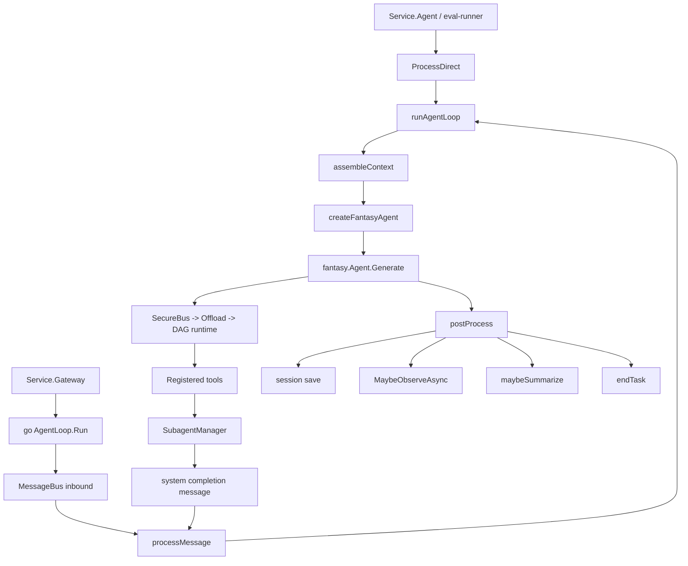
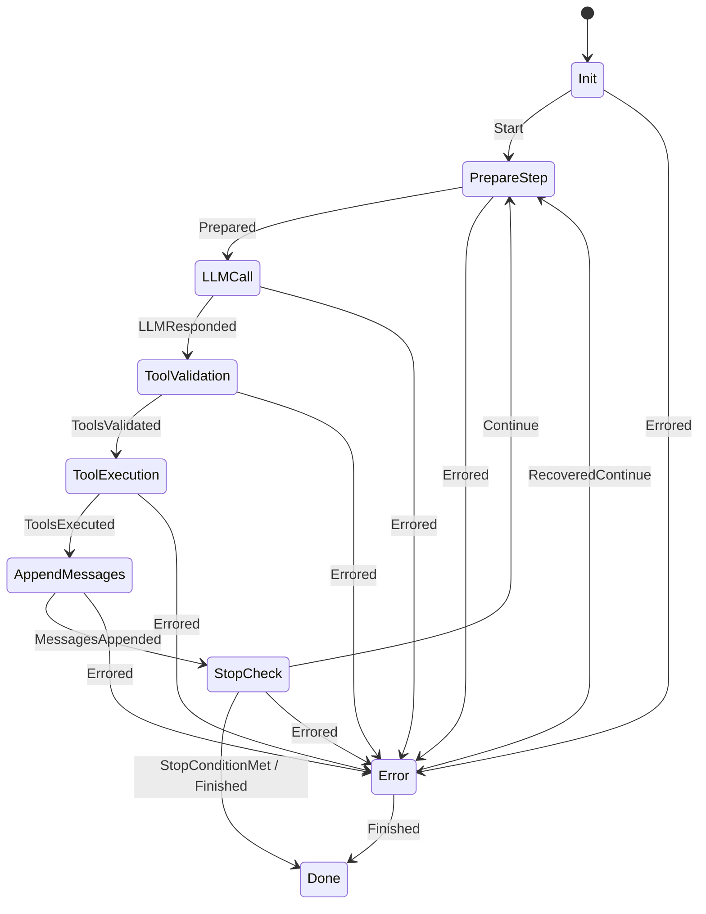

# DragonScale Reconcile Report (Historical + Current)

## Audit Frame
- Scope: repository code, runtime architecture, memory stack, roadmap/docs/ADR drift, eval harness, and prior audit transcript context.
- Method: static reconciliation only. I inspected code and transcript artifacts; I did not run `go test`, `make eval`, TLC, or live external systems in this pass.
- Confidence: high on structural truth, medium on dynamic behavior that depends on live execution.
- Status note: sections `1` through `7` capture the pre-reconciliation audit state that drove the repair plan. The section `Reconciliation Status (2026-03-21)` below is the current implementation truth after the kernel-drift execution batches.

## Executive Truth
- The shipped core is a **unified kernel runtime**, not the older optional-path runtime. The real production stack is `Service.Agent|Gateway` -> `runtime.Bootstrap` -> `AgentLoop` -> `fantasy.Agent.Generate` -> `SecureBusToolRuntime` -> `OffloadingToolRuntime` -> `fantasy.DAGToolRuntime`.
- The memory system is materially real and fairly deep: session recall, immutable messages, archival chunks + embeddings, observational memory, DAG snapshots, focus knowledge blocks, projection pointers, hybrid retrieval, and background maintenance all exist in code.
- The repo currently mixes **three separate context systems**:
  - `ContextBuilder` system-prompt assembly and section budgeting
  - `ContextTree` query-adaptive selection over older history
  - persistent `DAG` snapshots and DAG tools for lossless recovery/search
- The biggest remaining truth gaps are **observability/runtime bookkeeping**, not base execution:
  - `agent_state_transitions` exists in schema but is not populated in production
  - persisted/offloaded tool result `step_index` is not trustworthy
  - `ActiveContextBuilder` exists as a contract only, not a live implementation
  - `pkg/rlm` exists and is tested, but is not wired into production
- Documentation currently overstates some planned architecture and understates some shipped architecture.

## Reconciliation Status (2026-03-22)
- Runtime observability gaps called out above are now resolved in code: FSM transitions persist, step indices are propagated through tool execution, and task metrics count real tool activity instead of raw ReAct step count.
- The context kernel is now live as a production builder: `ActiveContextBuilder` assembles `ActiveContextProjection` segments, DAG projections are rendered into turn context, and session binding is resolved per active session rather than leaking through `default`.
- The memory kernel is materially stronger than the historical audit state: semantic ContextTree behavior is active, runtime checkpoints are created and can restore or fork sessions, and RLM reduction is wired into active-context assembly for oversized DAG / recall / archival segments.
- Audit persistence now stores explicit `success`, `error_msg`, and `tool_call_id` fields instead of inferring outcomes from action strings.
- Eval and docs reconciliation is complete for the kernel-drift scope: eval runner auto-build is live, `eval-compare` uses a temporary worktree, core docs (`README.md`, `ROADMAP.md`, ADRs, eval docs) were reconciled to implementation truth, and the final verification ladder is green.
- Remaining intentional gaps are now strictly future-work items:
  - deeper RLM memory-controller orchestration beyond the current reducer baseline
  - full daemon / WASM isolation stages from the longer-range secure-runtime roadmap

## Final Verification Evidence (2026-03-22)
- `go test ./...` passed.
- `go test -race ./...` passed.
- `make eval` passed at `62 passed / 0 failed / 0 errors` in `17m 8s`, writing the artifact to `eval/results/latest.json`.
- The last red eval was `memory search with no results: graceful empty response`; root cause was prompt-echo leakage from session-message recall rows and working-context projection during memory retrieval.
- Final remediation was applied in `pkg/memory/store/memory_store.go` by suppressing memory-search instruction echoes while keeping real stored matches, with regression coverage added in `pkg/memory/store/memory_tool_test.go`.
- Repository truth, report truth, and Memory Bank truth now converge on a fully green reconciliation closeout.

## Historical Findings (Pre-Reconciliation Baseline)
The next sections preserve the original audit findings that motivated the repair program.
Read them as historical counterexamples, not as the final current-state claim.

## Architectural Namespace Map
- Execution DAG: `internal/fantasy/tool_runtime_dag.go` for parallel tool execution from `$tool.<id>` dependencies.
- Memory DAG: `pkg/memory/dag/*` for deterministic hierarchical conversation compression and persistent snapshots.
- Skill Graph: `pkg/skills/*` + `pkg/tools/skills.go` for wikilink-based discovery and traversal.
- Context Tree: `pkg/contexttree/tree.go` for per-turn relevance scoring over historical messages.
- RLM: `pkg/rlm/*` exists as a separate decomposition engine but is not part of the current runtime path.

## 1. Control-Flow Truth

### Entry Modes
- `pkg/dragonscale/sdk/service_ops.go` has two real entry styles.
- CLI and eval-style direct calls use `Agent()` -> `ProcessDirect(...)`; this does **not** start `AgentLoop.Run`.
- Gateway mode uses `Gateway()` -> `go agentLoop.Run(appCtx)` and routes inbound channel traffic through `MessageBus`.

### Main Turn Path
- `pkg/agent/message_router.go` routes user traffic to `runAgentLoop(...)`.
- `pkg/agent/agent_run.go` assembles context, creates a per-turn `AgentConversation` and `AgentRun`, and builds the `fantasy.Agent`.
- `pkg/agent/agent_run.go` wires the runtime stack as:
  - `SecureBusToolRuntime`
  - wrapping `OffloadingToolRuntime`
  - wrapping `fantasy.DAGToolRuntime`
- `internal/fantasy/agent.go` runs the ReAct loop:
  - prepare step
  - LLM call
  - tool validation
  - tool execution
  - append messages
  - stop check
  - repeat or finish

### Background Planes
- `pkg/runtime/bootstrap.go` hard-fails if SecureBus or unified runtime deps are missing.
- `pkg/agent/loop.go` starts `cortex.Cortex` in the background when `AgentLoop.Run` is active.
- `pkg/cortex/cortex.go` schedules memory decay, embedding backfill, consolidation, prune, RL, audit analysis, and drift tasks.

### Subagent Plane
- `pkg/agent/toolloop.go` gives subagents the same unified runtime stack as the parent.
- `pkg/tools/subagent.go` enforces delegation depth and fanout bounds before spawn.
- Subagent completion is published back as a `system` inbound message.
- `pkg/agent/message_router.go` intentionally does **not** forward that system completion to the user; it only logs it.
- Real user-visible subagent communication therefore depends on the subagent using the message/output tools directly.



## 2. ReAct State Machine Truth
- The explicit FSM is defined in `internal/fantasy/react_fsm_machine.go`.
- The state graph is:
  - `Init`
  - `PrepareStep`
  - `LLMCall`
  - `ToolValidation`
  - `ToolExecution`
  - `AppendMessages`
  - `StopCheck`
  - `Done`
  - `Error`
- `internal/fantasy/agent.go` constructs the FSM and emits transitions through optional observers.
- The observer API is real: `WithTransitionObserver`, `WithStepObserver`, and `WithToolResultObserver` exist.
- Production `AgentLoop` does **not** attach any of those observers when building the fantasy agent.
- Result: the FSM exists, the transition log exists, the DB table exists, but runtime transition persistence is not live.



## 3. Tool Runtime Algorithms and Data Structures

### DAG Tool Execution
- `internal/fantasy/tool_runtime_dag.go` builds a DAG from JSON references like `$tool.<toolCallID>`.
- Dependency resolution is structural, not semantic; it rewrites JSON values, not arbitrary prose.
- Ready nodes are executed in topological waves.
- If a ready node is not parallel-safe, it becomes a barrier and executes alone.
- Parallel-safe ready nodes execute concurrently up to `MaxConcurrency` and then commit in deterministic input order.
- This is effectively:
  - dependency analysis
  - indegree tracking
  - barrier detection
  - bounded wave parallelism
  - deterministic result commit

### SecureBus
- `pkg/security/securebus/bus.go` is the privilege boundary.
- The synchronous in-process path is:
  - capability lookup
  - policy validation
  - secret injection
  - execute underlying tool
  - leak scan / redaction
  - audit append
- In the current agent runtime, SecureBus is used synchronously through `Bus.Execute(...)`, not via the transport worker queue.

### Offloading
- `pkg/agent/offloading_tool_runtime.go` stores full tool payloads in KV and writes searchable preview rows into `agent_tool_results`.
- Large text results are chunked.
- `tool_result_search` is the live retrieval surface for those stored results.

### Important Runtime Nuance
- `OffloadingToolRuntime` reads the step index from `WithStepIndex(ctx, ...)`.
- `WithStepIndex(...)` is defined, but there are no production call sites.
- Therefore offloaded tool results default to `step_index = 0`.

## 4. Memory System Truth

### Persistence Planes
- Plane 1: session persistence in `pkg/session/manager.go`
- Plane 2: memory tiers in `pkg/memory/store/*` + delegate in `pkg/memory/delegate/sqlite.go`
- Plane 3: runtime/run-state persistence in `pkg/agent/state_store.go`

### Session Persistence
- `SessionManager` keeps in-memory session maps plus optional disk storage plus async DB dual-write.
- Each appended message becomes a `RecallItem`.
- Each appended message is also dual-written as an `ImmutableMessage` when supported.
- Projection pointers are advanced and persisted on append.
- On restore, persisted recall history is replayed chronologically and projection pointers are validated.

### Tiered Memory
- Working context: session-scoped hot memory from delegate-backed working-context records.
- Recall: append-only episodic message records.
- Archival: chunked long-form memory, optionally embedded as `F32_BLOB`.
- Observation: LLM-generated prioritized observations with three-date metadata.
- Knowledge: focus-completion summaries persisted into KV and injected into prompt.
- DAG snapshots: deterministic session compression stored as snapshots, nodes, and edges.

### Observation System
- `pkg/memory/observation/manager.go` is real and asynchronous.
- Observations carry:
  - `ObservedAt`
  - `ReferencedAt`
  - `RelativeDate`
- Observer and reflector are separate components.
- Concurrency is guarded per session by an in-memory running map.

### Deterministic DAG Compression
- `pkg/memory/dag/compress.go` is not LLM-based.
- Algorithm:
  - group messages into chunks of 8
  - summarize chunk by first sentence per message
  - group chunks into sections of 4
  - produce optional session summary node
- This is deterministic, reproducible, and auditable.
- Persistent snapshots are hashed and stored via `pkg/memory/dag/store.go`.

### Hybrid Retrieval Router
- `pkg/memory/store/memory_store.go` and `pkg/memory/store/retrieval.go` implement the real retrieval pipeline:
  1. keyword search
  2. vector search if embedder exists
  3. reciprocal rank fusion
  4. recency decay
  5. metadata filtering
  6. hybrid projection search over working context + DAG summaries
  7. policy-gated selection between baseline and augmented results
- `pkg/memory/store/retrieval_policy.go` adds a shadow-mode promotion state machine:
  - bootstrap in `shadow`
  - promote when parity/overlap gates are met
  - rollback if promoted quality drops

### Context Tree Reality
- `pkg/contexttree/tree.go` supports:
  - semantic + lexical score blending
  - time decay
  - access-frequency weighting
  - type priors
  - Boltzmann pruning
  - hysteresis
- Production `pkg/agent/summarizer.go` does **not** use the full algorithm.
- Actual production path:
  - creates tree nodes with `embedding=nil`
  - scores with `queryEmbedding=nil`
  - sorts deterministically by score
  - greedily fills a token budget
  - caches rendered output by `(sessionKey, query, messageCount)`
- So the live system currently uses **lexical + temporal + frequency + type prior** scoring, not semantic scoring.
- Also, live selection does **not** use the package's Boltzmann sampling or hysteresis helpers.

### Context Budget Truth
- `pkg/memory/dag/budget.go` defines a nice budget model for system prompt, observations, knowledge, DAG summaries, raw tail, and tool results.
- `ContextBuilder` separately enforces a system-prompt budget of roughly 40% of context window.
- `applyContextTreeSelection(...)` separately uses `dag.ComputeBudget(...)` to size the raw tail and query-selected history block.
- This means budgeting is currently split across multiple components rather than unified behind one `ActiveContextBuilder`.

## 5. Real Data Structures
- `MessageBus`: buffered inbound/outbound channels plus handler map.
- `SubagentManager`: `tasks` map, `activeChildren` map, next ID counter, depth/fanout caps.
- `ContextTree`: root node, `NodeIndex` map, node children arrays, scoring config.
- `MemoryStore`: delegate, embedder, policy cache, retrieval gates/metrics.
- `DAG`: node map plus root list; persisted as snapshot row + node rows + edge rows.
- `SessionManager`: in-memory session map, LRU, async persist queue, projection-pointer records.
- `StateStore`: `agent_runs`, `agent_run_states`, `agent_state_transitions`, `agent_tool_results`, `agent_checkpoints`.
- `SecureBus`: policy engine, secret store, redactor, audit log, optional transport.
- `ProjectionContract`: `ActiveContextProjection`, `ProjectionSegment`, `ImmutableSpanRef` in `pkg/memory/kernel_contract.go`.

## 6. Reconciliation Matrix

### Shipped and true
- Unified kernel runtime with fail-fast boot invariants.
- SecureBus mediation for tool execution.
- Offloaded tool result persistence and retrieval.
- DAG tool execution with dependency-aware parallel waves.
- Observational memory with async manager.
- Focus primitives with knowledge-block accumulation.
- Skill graph tooling: `skill_search`, `skill_read`, `skill_traverse`.
- Retrieval tools: `keyword_search`, `semantic_search`, `chunk_read`.
- Persistent DAG snapshots and DAG tools: `dag_expand`, `dag_describe`, `dag_grep`.
- Projection pointers and deterministic session restore validation.
- Subagent depth/fanout/runtime parity guardrails.
- Promptfoo harness with `maxConcurrency: 1` in `eval/promptfooconfig.yaml`.

### Present but partial
- Run-state persistence is live, but the step indexing story is incomplete.
- ContextTree package is richer than its actual production use.
- Kernel projection contracts exist as types, not as a production builder.
- Checkpoint and conversation fork/merge scaffolding exist, but runtime checkpoint creation is not wired.
- Eval hardening plan exists, but docs do not clearly reconcile plan-vs-current behavior.

### Present in docs more than code
- RLM integration.
- some ADR-001 convergence claims around live RLM-backed execution.
- README migration count and config sample.
- roadmap sections that still read as future work even where tools/features are already shipped.

### Present in code but not wired
- `WithTransitionObserver` / `AddTransition`.
- `WithStepIndex(...)`.
- `ActiveContextBuilder`.
- `CheckpointStore` production usage.
- `pkg/rlm` production imports outside tests.

## 7. Counterexample-Style Findings

### Finding 1: `TransitionPersistenceComplete` is false
- Claim: every FSM transition is persisted.
- Counterexample: `internal/fantasy/agent.go` supports transition observers, and `pkg/agent/state_store.go` supports `AddTransition`, but `pkg/agent/agent_run.go` never attaches `WithTransitionObserver(...)`.
- Effect: `agent_state_transitions` is effectively dead schema in production.

### Finding 2: `MonotonicStepIndex` is false
- Claim: persisted run/tool records preserve the true ReAct step number.
- Counterexample: `pkg/agent/offloading_tool_runtime.go` reads step index from context via `StepIndexFromCtx(...)`, but `WithStepIndex(...)` has no production callers.
- Counterexample: `pkg/agent/securebus_runtime.go` has a `StepIndex` field, but the fantasy agent is created with no per-step updates to that field.
- Effect: `agent_tool_results.step_index` is effectively always `0`, and `agent_run_states.step_index` is not a trustworthy global turn-step index.

### Finding 3: `SemanticContextSelection` is overstated
- Claim: ContextTree production selection is semantic + lexical.
- Counterexample: `pkg/agent/summarizer.go` passes `nil` embeddings into `ContextTree`.
- Effect: live selection is lexical/temporal/frequency/type-prior only.

### Finding 4: `ContextBudgetingIsUnified` is false
- Claim: one controller owns active-context assembly.
- Counterexample: `ContextBuilder`, `applyContextTreeSelection(...)`, DAG budget helpers, and working-context injection each own part of the budget story.
- Effect: the architecture is effective but still transitional, not yet a single controller model.

### Finding 5: `RLMIntegrated` is false
- Claim: production agent runtime uses `pkg/rlm`.
- Counterexample: repo-wide imports of `pkg/rlm` outside tests are absent.
- Effect: RLM is a tested subsystem and an architectural direction, not current runtime truth.

### Finding 6: `CheckpointableRuntime` is partial
- Claim: runtime can be checkpointed and forked as a normal live feature.
- Counterexample: checkpoint APIs and fork/merge storage exist, but there is no production path that creates checkpoints during normal agent execution.
- Effect: the storage layer exists ahead of the runtime behavior.

### Finding 7: `RLToolCallMetric` is imprecise
- `pkg/agent/agent_run.go` records `TaskCompletion.ToolCalls = stepCount`.
- Effect: RL/task analytics are counting ReAct steps, not true tool invocations.

## 8. Documentation Drift
- `README.md` still says Goose has 10 versioned migrations; the repo now has 16 numbered migrations plus context wiring.
- `README.md` includes `"tools.progressive_disclosure": true`, but `pkg/config/config.go` has no such field. Progressive disclosure is effectively runtime behavior, not a config toggle.
- `README.md` and ADR-001 imply RLM is part of the live execution story; code does not support that.
- `ROADMAP.md` still treats some already-shipped features as future work and leaves others underspecified relative to code truth.
- `docs/adr/001-isolated-tool-runtime.md` is still `Proposed` even though large parts of the secure runtime architecture are already live.
- `eval/README.md` does not fully reconcile with the signal-first hardening plan that discussed `35/38`, generic fallback leakage, and concurrency/determinism concerns.
- The hardening plan references `eval/promptfooconfig-default.yaml`, but the live repo uses `eval/promptfooconfig.yaml`.

## 9. TLA+ Spec Brief

### System
- A single agent runtime that receives messages, assembles bounded context, executes zero or more tool steps through a mediated runtime, persists turn artifacts, and may delegate to subagents.

### Actors
- User / external channel
- `AgentLoop`
- `fantasy.Agent` ReAct controller
- `SecureBus`
- tool runtime / tools
- `SessionManager`
- `MemoryStore`
- `SubagentManager`
- `Cortex`
- environment failures: DB errors, model errors, tool errors, cancellation

### State
- inbound queue
- outbound queue
- sessions and immutable history
- working context / observations / knowledge / DAG snapshots
- active runs and run states
- persisted tool results
- active subagent tasks
- audit log

### Safety invariants worth checking
- `I_SecureBusMediatesAllToolExec`
- `I_DelegationDepthBound`
- `I_DelegationFanoutBound`
- `I_ProjectionPointerMonotonic`
- `I_ToolResultRowHasReachableFullKey`
- `I_NoOrphanToolMessageAfterTruncation`
- `I_TransitionPersistenceComplete` currently false
- `I_MonotonicStepIndex` currently false

### Liveness properties worth checking
- If a user message is accepted and the model/tool runtime eventually returns, the run eventually reaches `Done` or explicit `Error`.
- If a subagent is spawned and its run loop terminates, the parent eventually receives a completion announcement.
- If observation threshold is crossed and storage/model calls succeed, observation state eventually updates.
- If hard compaction threshold is crossed and summarization succeeds within bounded cycles, token pressure eventually drops below the critical threshold.

### Minimal TLC model bounds
- 1 session
- at most 3 ReAct steps
- at most 2 tool calls per step
- at most 1 subagent child per step
- max delegation depth 2
- max DAG ready set 2
- bounded observation list of 4 items
- bounded history of 6 messages

```tla
---- MODULE DragonScaleKernel ----
EXTENDS Sequences, FiniteSets, TLC

VARIABLES inboundQ, sessions, runs, runStates, toolResults, subagents, audits

Init ==
  /\ inboundQ = << >>
  /\ sessions = [s \in {"s0"} |-> << >>]
  /\ runs = [r \in {} |-> [status |-> "none"]]
  /\ runStates = {}
  /\ toolResults = {}
  /\ subagents = {}
  /\ audits = << >>

ReceiveUser(msg) == inboundQ' = Append(inboundQ, msg)
StartTurn == \E msg \in SeqToSet(inboundQ): TRUE
ExecuteTool == TRUE
PersistToolResult == TRUE
CompleteTurn == TRUE
SpawnSubagent == TRUE
FinishSubagent == TRUE

Next ==
  \/ \E msg : ReceiveUser(msg)
  \/ StartTurn
  \/ ExecuteTool
  \/ PersistToolResult
  \/ CompleteTurn
  \/ SpawnSubagent
  \/ FinishSubagent
====
```

## 10. Sequential Priority Order

1. Fix runtime observability first.
   - Wire `WithTransitionObserver(...)` from `pkg/agent/agent_run.go` into `StateStore.AddTransition(...)`.
   - Propagate true step numbers into `SecureBusToolRuntime` and `OffloadingToolRuntime`.
   - Change RL `ToolCalls` accounting from step count to actual tool result count.

2. Reconcile the context model second.
   - Decide whether `ActiveContextBuilder` becomes real or gets downgraded to a future contract.
   - Decide whether ContextTree remains lexical-only or receives real embeddings.
   - Decide whether DAG prompt rendering should be direct runtime input or remain a search/recovery structure.

3. Reconcile docs third.
   - Update `README.md`, `ROADMAP.md`, `ADR-001`, and `eval/README.md` to code-truth.
   - Explicitly mark RLM as “present in package, not wired in production” unless that changes.

4. Decide the fate of RLM and checkpoints fourth.
   - Either wire `pkg/rlm` and runtime checkpoints for real, or demote those claims out of the production architecture story.

5. Refresh live truth last.
   - Re-run `go test ./...`
   - Re-run promptfoo
   - Re-check any external tracker state only after code/docs truth are aligned

## Bottom Line
- DragonScale already has a real, non-trivial kernel: mediated tool execution, async memory maintenance, persistent session continuity, retrieval routing, focus/obligation/skill graph tooling, and subagent guardrails are all live.
- The repo is **not** yet in a single perfectly reconciled architectural state.
- The main unresolved gap is that the runtime's **bookkeeping and docs lag the actual kernel**: transitions are not persisted, step indexes are not authoritative, RLM is not wired, and documentation still blends shipped behavior with intended behavior.